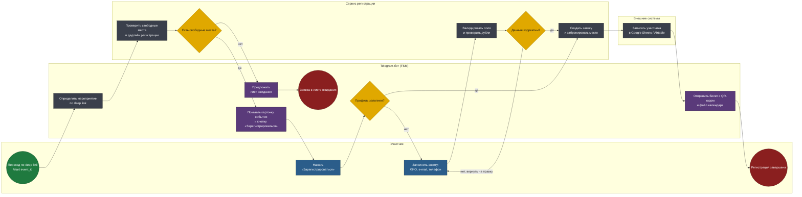
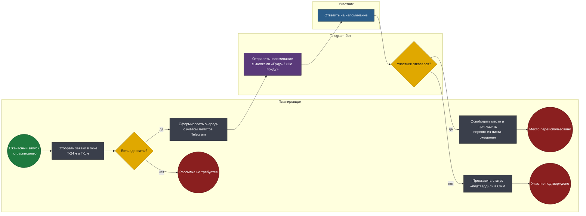
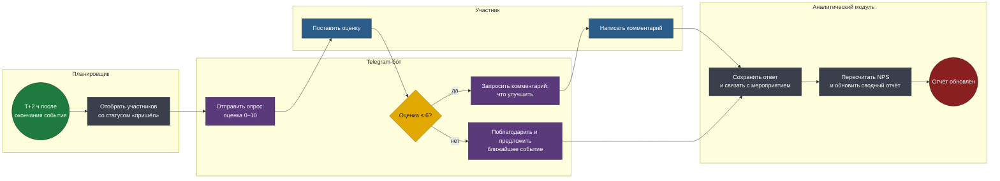

# BPMN 2.0 — Telegram-бот регистрации на мероприятия

Три сквозных процесса покрывают жизненный цикл участника: регистрация,
удержание до события, обратная связь после него.

Исходники в нотации BPMN 2.0 лежат в [diagrams/](diagrams/) и открываются в
Camunda Modeler, bpmn.io, Visual Paradigm или любом инструменте, читающем
BPMN 2.0 XML. Схемы ниже сгенерированы из тех же моделей, что и `.bpmn`, —
разойтись они не могут.

## Соглашения нотации

| Элемент | Как читать |
|---|---|
| Дорожка (lane) | Кто владеет шагом: участник, бот, серверная логика, внешняя система |
| Прямоугольник | Задача. Синяя — ручная (user task), серая — автоматическая (service task), фиолетовая — отправка сообщения (send task) |
| Ромб | Исключающий шлюз: ровно одна исходящая ветка |
| Зелёный круг | Стартовое событие (сообщение или таймер) |
| Красный круг | Конечное событие — все ветки процесса завершены явно |

---

## 1. Регистрация участника

Основной процесс. Точка входа — deep link вида `t.me/bot?start=event_42`,
который организатор публикует в анонсе. Бот сразу знает, о каком мероприятии
идёт речь, — участник не выбирает событие из списка вручную. Это ключевое
решение для конверсии 85%: из воронки убран целый шаг.

**Файл:** [`diagrams/01-registration.bpmn`](diagrams/01-registration.bpmn)

<!-- diagram:01-registration -->

<!-- /diagram -->

### Решения, зашитые в модель

**Проверка вместимости идёт до показа карточки.** Участник не должен узнавать
об отсутствии мест после того, как заполнил анкету, — это главный источник
негатива и брошенных заявок. Если мест нет, бот сразу предлагает лист ожидания
как альтернативу, а не как отказ.

**Профиль переиспользуется между мероприятиями.** Шлюз «Профиль заполнен?»
пропускает повторного участника мимо анкеты сразу к бронированию. На втором и
последующих событиях регистрация укладывается в два нажатия.

**Валидация возвращает на правку конкретного поля, а не всей формы.** Обратная
связь от шлюза «Данные корректны?» ведёт в задачу заполнения анкеты, где FSM
хранит уже введённые значения. Пользователь исправляет только e-mail, а не
вводит имя и телефон заново.

**Место бронируется до синхронизации с CRM.** Google Sheets и Airtable —
внешние системы с квотами и таймаутами; их недоступность не должна ломать
регистрацию. Заявка фиксируется в собственной БД, синхронизация идёт следом и
при сбое уходит в очередь на повтор.

---

## 2. Автоматические напоминания

Процесс запускается по таймеру, а не по событию пользователя. Планировщик
раз в час забирает заявки, попадающие в окна T-24 ч и T-1 ч.

**Файл:** [`diagrams/02-reminders.bpmn`](diagrams/02-reminders.bpmn)

<!-- diagram:02-reminders -->

<!-- /diagram -->

### Решения, зашитые в модель

**Ежечасный тик вместо задачи на каждую заявку.** Планировщик работает окнами:
это на порядок меньше запланированных задач, переживает рестарт сервиса и
корректно обрабатывает перенос мероприятия — время пересчитывается на лету.

**Напоминание — это не уведомление, а точка принятия решения.** Кнопки
«Буду» / «Не приду» превращают рассылку в инструмент управления явкой: отказ
за 24 часа освобождает место, и оно уходит первому в листе ожидания
автоматически.

**Отдельная ветка на пустую выборку.** Если адресатов нет, процесс завершается
явным конечным событием. В BPMN нет «просто ничего не произошло» — каждая
ветка должна иметь конец, иначе модель нельзя проверить на полноту.

---

## 3. Пост-ивентный NPS-опрос

Запускается через два часа после окончания мероприятия — участник уже дома,
впечатление ещё свежее.

**Файл:** [`diagrams/03-nps-survey.bpmn`](diagrams/03-nps-survey.bpmn)

<!-- diagram:03-nps-survey -->

<!-- /diagram -->

### Решения, зашитые в модель

**Опрос уходит только тем, кто пришёл.** Рассылать NPS всем
зарегистрированным — значит смешивать оценку мероприятия с досадой тех, кто не
дошёл, и получить бесполезное среднее.

**Уточняющий вопрос — только детракторам.** Ветка «оценка ≤ 6» просит
комментарий, промоутерам вместо этого предлагается следующее событие. Так
качественная обратная связь собирается там, где она информативна, а лояльные
участники сразу возвращаются в воронку.

**Один вопрос — один экран.** Оценка ставится нажатием inline-кнопки, а не
вводом текста: это разница между 60% и 15% ответивших.

---

## Как открыть исходники

```bash
# bpmn.io — онлайн, ничего ставить не нужно
open https://demo.bpmn.io/   # затем перетащить .bpmn в окно

# Camunda Modeler — десктоп
brew install --cask camunda-modeler
```

Перегенерация моделей после правки:

```bash
python3 tools/build_diagrams.py
```
