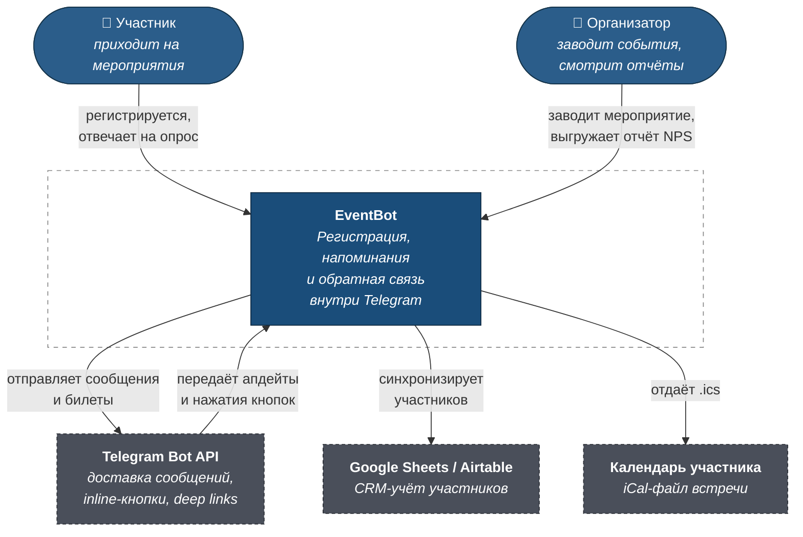
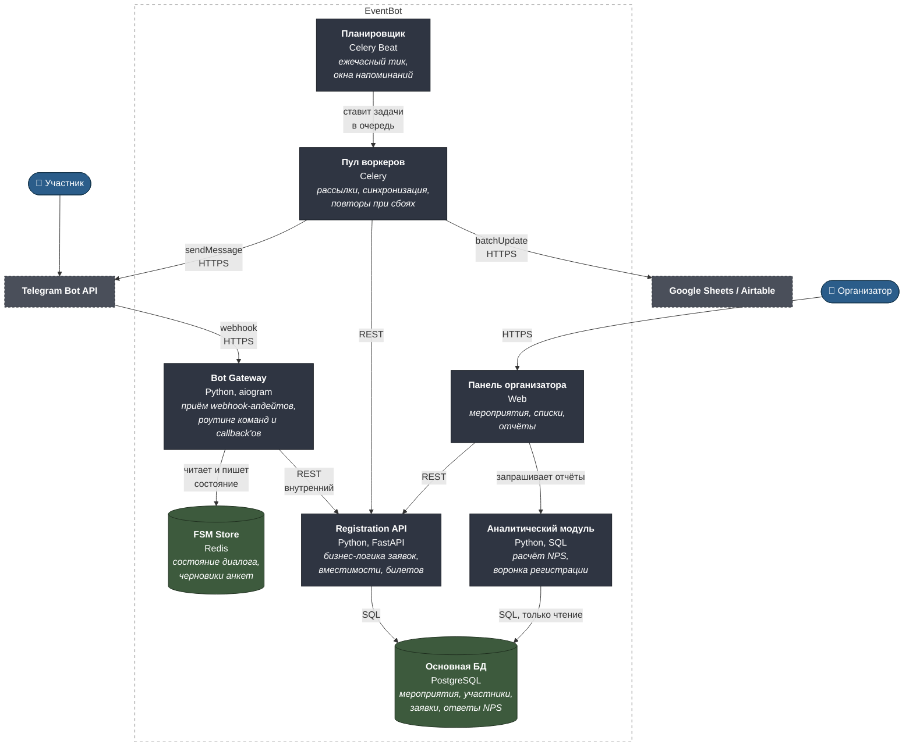
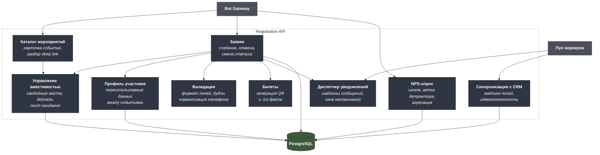
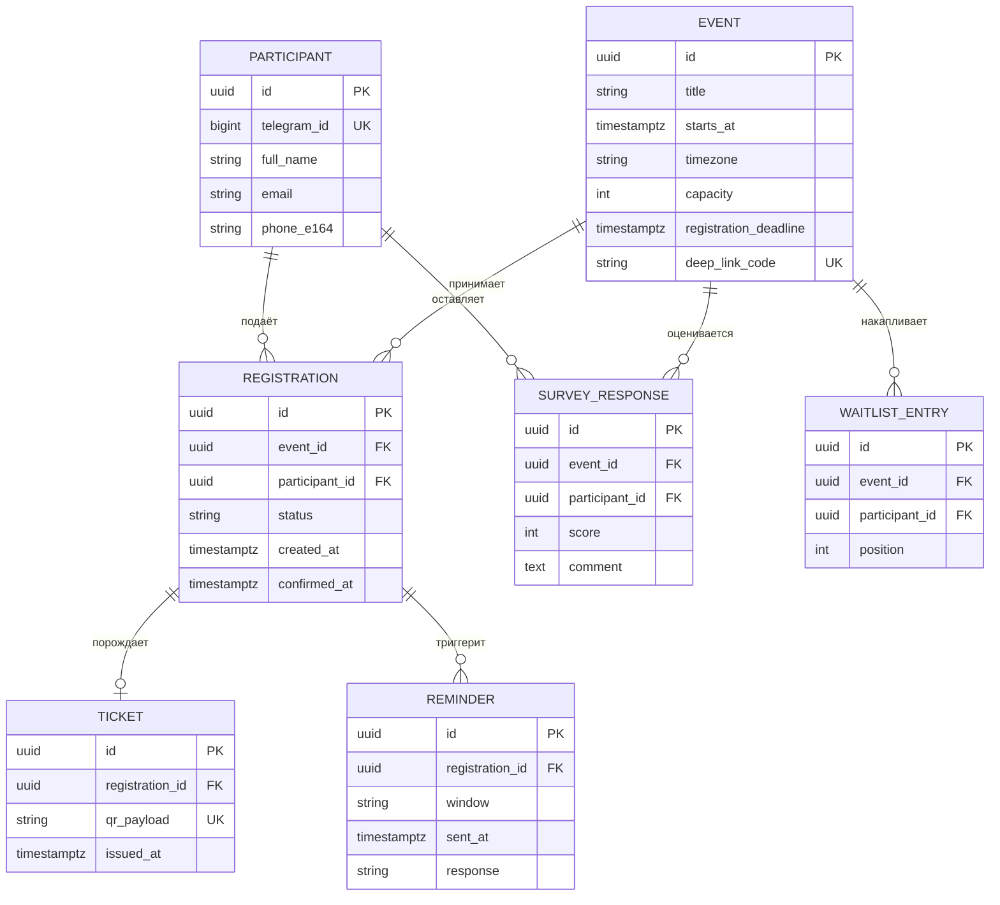

# C4 — Telegram-бот регистрации на мероприятия

Архитектура описана по модели C4 на трёх уровнях: контекст, контейнеры,
компоненты. Машиночитаемый исходник — [`c4/workspace.dsl`](c4/workspace.dsl)
в формате Structurizr DSL.

Легенда цветов на схемах: синий — люди, тёмно-серый — контейнеры внутри
системы, серый пунктир — внешние системы.

---

## Уровень 1. Контекст системы

Кто пользуется системой и с чем она разговаривает наружу.



### Границы системы

В скоуп **входит**: приём заявок, управление вместимостью и листом ожидания,
напоминания, электронный билет, NPS-опрос и сводная отчётность.

В скоуп **не входит**: продажа билетов и эквайринг, регистрация на входе по
QR-коду (сканер — отдельный контур), рассылки по e-mail. Эти границы
зафиксированы намеренно: платёжный контур тянет за собой 54-ФЗ и кассовую
дисциплину, что кратно увеличивает срок и стоимость MVP.

---

## Уровень 2. Контейнеры

Как система устроена внутри — единицы развёртывания и хранения.



### Почему так

**Gateway отделён от бизнес-логики.** Telegram требует ответа на webhook за
секунды, иначе апдейт переотправляется и пользователь получает дубли. Gateway
делает минимум — разбирает апдейт, читает состояние FSM, вызывает API — и
никогда не ходит во внешние сети синхронно.

**Состояние диалога живёт в Redis, а не в PostgreSQL.** Черновик анкеты
меняется на каждом нажатии; писать это в основную БД — лишняя нагрузка на
хранилище, у которого другой профиль записи и другие требования к сохранности.
Потеря черновика некритична, потеря заявки — критична, и это разные хранилища.

**Рассылки идут через очередь, а не из обработчика.** Telegram ограничивает
скорость отправки: около 30 сообщений в секунду суммарно и 20 в минуту в одну
группу. Воркер с ретраями и бэкоффом — единственный способ разослать
напоминание тысяче участников, не поймав `429 Too Many Requests`.

**Аналитика читает из основной БД в режиме только чтения.** На объёмах проекта
отдельное хранилище не оправдано, но разделение прав доступа не даёт
отчётному запросу заблокировать регистрацию.

---

## Уровень 3. Компоненты Registration API

Внутреннее устройство контейнера, где сосредоточена бизнес-логика.



### Ключевые контракты между компонентами

| Компонент | Отвечает за | Не отвечает за |
|---|---|---|
| Управление вместимостью | Единственный источник правды о свободных местах; бронь и её снятие атомарны | Кому отдать освободившееся место — это решает диспетчер уведомлений |
| Заявки | Жизненный цикл статусов: черновик → подтверждена → отменена → посетил / не пришёл | Формат сообщений участнику |
| Диспетчер уведомлений | Какой шаблон, кому и когда отправить | Доставку — это воркер и Telegram API |
| Синхронизация с CRM | Идемпотентную выгрузку: повторный запуск не плодит дубли строк | Формат таблицы организатора — он настраивается маппингом |

**Разделение вместимости и уведомлений — не формальность.** Когда участник
отказывается за 24 часа, освободившееся место нужно отдать первому в листе
ожидания. Если бы эту логику держал компонент вместимости, он должен был бы
знать про Telegram, шаблоны и часовые пояса. Вместо этого он публикует факт
«место освободилось», а решение о приглашении принимает диспетчер.

---

## Модель данных (ключевые сущности)



Ограничение целостности, которое держит всю модель: уникальный индекс на
паре `(event_id, participant_id)` в `REGISTRATION` со статусом не «отменена».
Повторное нажатие кнопки, дубль webhook-апдейта и параллельный запрос с двух
устройств упираются в базу, а не в проверку в коде.

---

## Как открыть DSL

```bash
# Structurizr Lite в Docker — рендерит workspace.dsl в интерактивные схемы
docker run -it --rm -p 8080:8080 \
  -v "$PWD/projects/01-telegram-event-bot/c4:/usr/local/structurizr" \
  structurizr/lite
```
