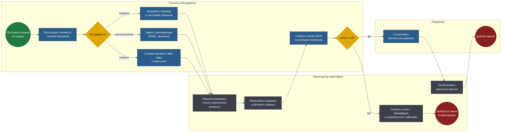

# BPMN 2.0 — Сервис AI-озвучки

Два процесса, разделённые по принципу «автомат отдельно, человек отдельно».
Первый работает без участия людей и заканчивается либо публикацией, либо
честным отказом. Второй запускается только на отказах.

Исходники в нотации BPMN 2.0 — в [diagrams/](diagrams/), открываются в
Camunda Modeler и bpmn.io. Схемы ниже генерируются из тех же моделей.

## Соглашения нотации

| Элемент | Как читать |
|---|---|
| Дорожка (lane) | Кто владеет шагом: продюсер, редактор, оркестратор, внешний AI-провайдер, видеохостинг |
| Прямоугольник | Задача: синяя — ручная, серая — автоматическая, фиолетовая — отправка сообщения |
| Ромб | Исключающий шлюз |
| Зелёный / красный круг | Стартовое и конечное события |

---

## 1. Пайплайн автоматического дубляжа

Сквозной процесс от постановки задачи до публикации дорожки на хостинге.

**Файл:** [`diagrams/01-dubbing-pipeline.bpmn`](diagrams/01-dubbing-pipeline.bpmn)

```mermaid
flowchart LR
    subgraph Lane_producer["Продюсер"]
        direction LR
        Start_task(("Поставлена задача<br/>на дубляж"))
        T_pick["Выбрать видео<br/>и целевые языки"]
        End_published(("Дубляж опубликован"))
    end
    subgraph Lane_orch["Оркестратор пайплайна"]
        direction LR
        T_fetch["Скачать исходник<br/>через API хостинга"]
        T_demux["Извлечь аудио (FFmpeg)<br/>и нормализовать уровень"]
        T_phonetic["Применить глоссарий<br/>и фонетическую коррекцию"]
        T_mix["Свести дорожку: длительность,<br/>громкость, фон"]
        T_qc["Автоконтроль: WER,<br/>рассинхрон, клиппинг"]
        G_qc{"Метрики в допуске?"}
        T_rework["Создать задачу<br/>на ручную правку"]
        T_notify["Уведомить продюсера<br/>о готовности"]
        End_rework(("Передано редактору"))
    end
    subgraph Lane_ai["AI-провайдеры (STT / MT / TTS)"]
        direction LR
        T_stt["Распознать речь<br/>и тайм-коды (STT)"]
        T_mt["Перевести транскрипт<br/>на целевой язык"]
        T_tts["Синтезировать речь (TTS)<br/>по тайм-кодам"]
    end
    subgraph Lane_host["Видеохостинг"]
        direction LR
        T_upload["Загрузить дорожку<br/>и заменить аудио"]
    end
    Start_task --> T_pick
    T_pick --> T_fetch
    T_fetch --> T_demux
    T_demux --> T_stt
    T_stt --> T_mt
    T_mt --> T_phonetic
    T_phonetic --> T_tts
    T_tts --> T_mix
    T_mix --> T_qc
    T_qc --> G_qc
    G_qc -- "да" --> T_upload
    G_qc -- "нет" --> T_rework
    T_rework --> End_rework
    T_upload --> T_notify
    T_notify --> End_published
    classDef evStart fill:#1f7a3f,stroke:#0f4523,color:#ffffff
    classDef evEnd fill:#8a1f1f,stroke:#4a0f0f,color:#ffffff
    classDef gw fill:#e0a800,stroke:#8a6800,color:#1a1a1a
    classDef userTask fill:#2b5d8a,stroke:#143349,color:#ffffff
    classDef svcTask fill:#3a3f4b,stroke:#1b1e24,color:#ffffff
    classDef msgTask fill:#5a3a7a,stroke:#2e1c40,color:#ffffff
    class Start_task evStart
    class T_pick userTask
    class T_fetch,T_demux,T_stt,T_mt,T_phonetic,T_tts,T_mix,T_qc,T_rework,T_upload svcTask
    class G_qc gw
    class End_rework,End_published evEnd
    class T_notify msgTask
```

<!-- diagram:01-dubbing-pipeline -->

<!-- /diagram -->

### Решения, зашитые в модель

**Фонетическая коррекция стоит между переводом и синтезом, а не после него.**
Это единственное место, где ещё можно вмешаться в произношение: после TTS
остаётся только звук, и исправить в нём «ЭйПиАй» вместо «API» уже нельзя —
только пересинтезировать. Глоссарий терминов, имён собственных и аббревиатур
применяется к тексту, а не к аудио.

**Автоконтроль качества — обязательный шлюз, а не отчёт.** Пайплайн физически
не может опубликовать выпуск с WER выше порога или рассинхроном больше
допустимого. Метрика, которую можно проигнорировать, не метрика: она
превращается в строчку в логе, которую никто не читает.

**Оркестратор не вызывает провайдеров напрямую из шага пайплайна.** STT, MT и
TTS — три внешних сервиса с разной латентностью, разными лимитами и разной
вероятностью отказа. Каждый вызов идёт через адаптер с ретраями и таймаутом,
а состояние выпуска сохраняется между шагами: падение на синтезе не заставляет
заново распознавать часовое видео.

**Отказ автоконтроля — не ошибка, а штатный выход процесса.** Ветка «нет»
ведёт в явное конечное событие «передано редактору», от которого стартует
второй процесс. Это разные процессы с разными владельцами, а не один
с бесконечной петлёй.

---

## 2. Ручная правка и приёмка

Запускается на выпусках, отклонённых автоконтролем. Задача процесса — не
«исправить всё», а устранить конкретную причину и заново пройти приёмку.

**Файл:** [`diagrams/02-editor-review.bpmn`](diagrams/02-editor-review.bpmn)

<!-- diagram:02-editor-review -->

<!-- /diagram -->

### Решения, зашитые в модель

**Шлюз «Тип дефекта?» разделяет три несводимых сценария правки.** Ошибка
перевода правится в тексте и глоссарии, ошибка произношения — транскрипцией
в SSML, рассинхрон — тайм-кодами и темпом. Это разные инструменты, разные
поля данных и разная длительность работы. Объединять их в «отредактировать
сегмент» — значит спрятать от команды реальную структуру трудозатрат.

**Пересинтезируются только изменённые сегменты.** Полный ресинтез часового
видео — это деньги провайдеру и десятки минут ожидания за исправленное слово.
Сегментная модель данных заложена именно ради этого шага.

**MOS-тест проводится после правки, а не вместо автоконтроля.** Автоматические
метрики ловят объективные дефекты дёшево и мгновенно; MOS отвечает на вопрос,
который метрикой не измеряется — «звучит ли это как человек». Порядок именно
такой: сначала бесплатная машинная проверка, потом дорогая человеческая.

**Провал MOS ведёт к смене конфигурации, а не ко второму кругу правок.**
Если после исправления причины оценка всё равно ниже 4.0, проблема не в
сегментах, а в выбранном голосе или провайдере для этого языка. Модель
явно фиксирует эту развилку вместо того, чтобы гонять редактора по кругу.

---

## Что процессы не покрывают намеренно

- **Липсинк и подгонка под движение губ.** Задача другого класса сложности,
  требует видеомодели; в скоупе — только выравнивание длительности реплики.
- **Дубляж живых трансляций.** Пайплайн пакетный; стриминговый режим
  потребовал бы другой архитектуры с потоковым STT и жёстким бюджетом задержки.
- **Клонирование голоса конкретного диктора.** Отдельный юридический контур
  согласия на использование голоса — сознательно вынесен за границы MVP.

---

## Как открыть исходники

```bash
open https://demo.bpmn.io/          # перетащить .bpmn в окно
brew install --cask camunda-modeler # десктопный редактор
```

Перегенерация после правки моделей:

```bash
python3 tools/build_diagrams.py
```
