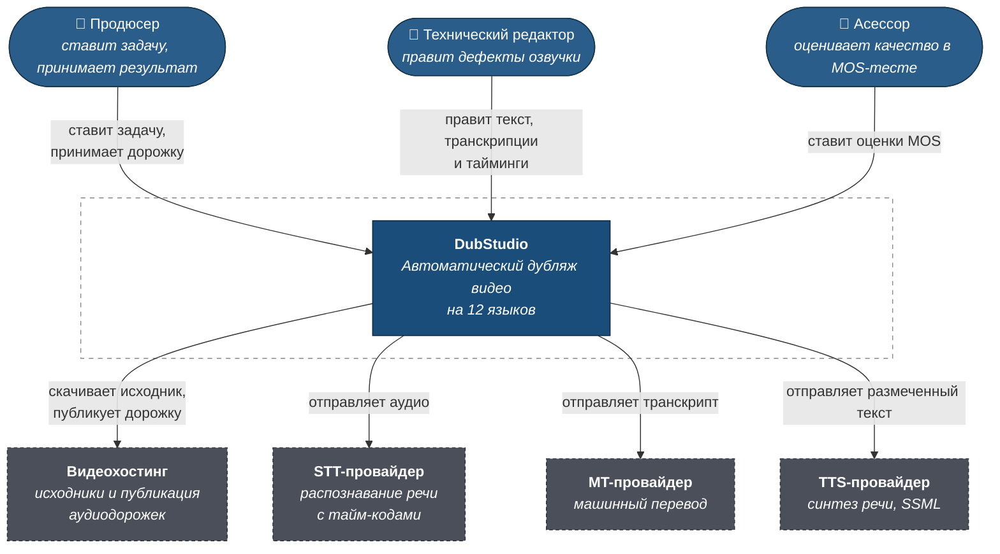
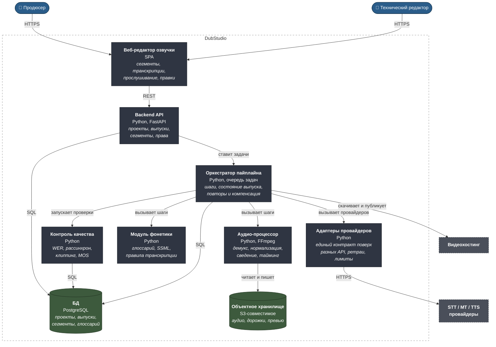
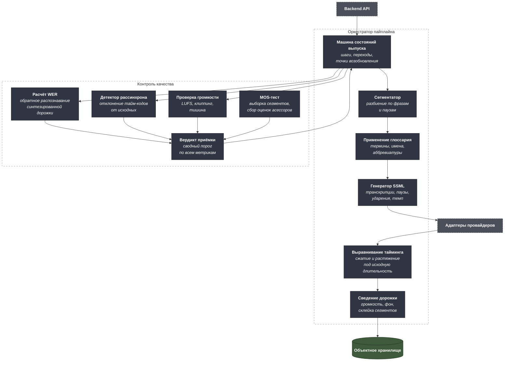
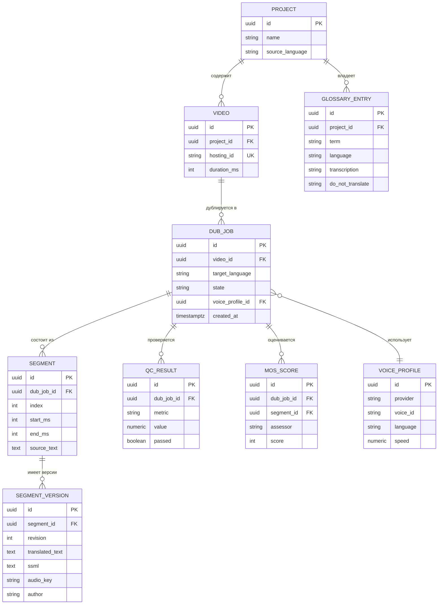

# C4 — Сервис AI-озвучки

Три уровня модели C4 плюс модель данных. Машиночитаемый исходник —
[`c4/workspace.dsl`](c4/workspace.dsl) в формате Structurizr DSL.

---

## Уровень 1. Контекст системы



### Границы системы

**В скоупе:** распознавание, перевод, фонетическая коррекция, синтез,
сведение, автоконтроль качества, MOS-приёмка, публикация дорожки.

**Вне скоупа:** липсинк под движение губ, дубляж прямых трансляций,
клонирование голоса конкретного диктора, монтаж видеоряда.

---

## Уровень 2. Контейнеры



### Почему так

**Адаптеры провайдеров вынесены в отдельный контейнер.** Это прямое следствие
задачи сравнения провайдеров: пока адаптер один, сменить TTS означает
переписать пайплайн. Единый внутренний контракт — «текст с разметкой на входе,
аудио и тайм-коды на выходе» — позволяет вести A/B на реальном контенте и
менять провайдера по языкам: для одного языка лучше один вендор, для другого —
другой, и это нормальное состояние системы, а не временное.

**Оркестратор хранит состояние выпуска между шагами.** Распознавание часового
видео стоит денег и минут. Если пайплайн упал на синтезе, он обязан
продолжиться с синтеза, а не с нуля. Каждый шаг идемпотентен и получает на
вход ссылку на артефакт предыдущего шага, а не пересчитывает его.

**Фонетика — отдельный модуль, а не настройка TTS.** Глоссарий терминов и
правила транскрипции — это доменные знания заказчика, которые живут дольше
любого вендора. Они хранятся в системе и применяются к тексту до передачи
провайдеру; при смене TTS глоссарий переезжает вместе с проектом.

**Аудио лежит в объектном хранилище, метаданные — в PostgreSQL.** Дорожка на
час занимает сотни мегабайт; в реляционной базе ей делать нечего. В базе —
сегменты, тайм-коды, версии текста и ссылки на артефакты.

---

## Уровень 3. Компоненты оркестратора и контроля качества



### Метрики приёмки

| Метрика | Что измеряет | Как считается | Порог |
|---|---|---|---|
| WER | Насколько синтез произносит то, что написано | Обратное распознавание готовой дорожки и сравнение с исходным текстом | ≤ 5% |
| Рассинхрон | Уход дорожки от картинки | Максимальное отклонение начала сегмента от исходного тайм-кода | ≤ 300 мс |
| Отклонение длительности | Перелив реплики за отведённое окно | Разница длительности сегмента и исходного | ≤ 15% |
| Громкость | Пригодность к публикации | Интегральная громкость по LUFS, наличие клиппинга | −16 ± 1 LUFS, без клиппинга |
| MOS | Субъективная естественность | Средняя оценка 1–5 на выборке ≥ 20 сегментов, ≥ 5 асессоров | ≥ 4.0 |

**Почему WER считается обратным распознаванием, а не сравнением с
транскриптом.** Ошибка может возникнуть на любом шаге: STT неверно распознал,
MT потерял отрицание, TTS проглотил окончание. Прогон готовой дорожки через
распознавание проверяет результат целиком, а не отдельное звено — это
сквозная проверка, а не проверка компонента.

---

## Модель данных



**Сегмент и его версии разделены намеренно.** Правка редактора не затирает
машинный вариант: она создаёт новую ревизию. Это даёт три вещи сразу —
возможность откатиться, материал для оценки того, как часто и что именно
приходится править вручную, и данные для настройки глоссария. Через месяц
работы видно, какие термины система стабильно произносит неправильно, и они
уходят в `GLOSSARY_ENTRY` вместо того, чтобы правиться каждый выпуск.

**`VOICE_PROFILE` привязан к выпуску, а не к проекту.** Один и тот же курс на
испанском и на японском может звучать голосами разных вендоров — это прямой
результат сравнения провайдеров по языкам.

---

## Сравнение TTS/STT-провайдеров: критерии выбора

Матрица, по которой принималось решение. Значения заполняются на пилоте
с реальным контентом заказчика, а не берутся из маркетинговых материалов
вендора.

| Критерий | Почему важен | Как проверялся |
|---|---|---|
| Покрытие языков | 12 целевых языков одним вендором дешевле в поддержке | Список поддерживаемых голосов на дату пилота |
| Поддержка SSML | Без разметки нет управления произношением терминов | Тест: транскрипция, пауза, ударение, темп |
| Качество на доменной лексике | Общий бенчмарк ничего не говорит о вашем контенте | MOS на 20 сегментах реального курса |
| Тайм-коды на выходе STT | Без них невозможно выровнять дорожку | Проверка формата ответа |
| Латентность и лимиты | Определяют время дубляжа часового видео | Замер на пакете из 10 роликов |
| Цена за минуту | Прямо влияет на целевые −75% | Расчёт на реальном объёме, а не на прайсе |
| Стабильность API | Отказы вендора становятся отказами продукта | Доля ошибок за две недели пилота |
| Условия по данным | Куда уезжает контент заказчика и хранится ли он | Юридическая проверка условий обработки |

Решение по итогам: единый внутренний контракт адаптера и возможность
назначать разного вендора на разные языки. Ни один провайдер не оказался
лучшим по всем двенадцати языкам одновременно — и архитектура не должна
делать вид, что оказался.

---

## Как открыть DSL

```bash
docker run -it --rm -p 8080:8080 \
  -v "$PWD/projects/02-ai-dubbing/c4:/usr/local/structurizr" \
  structurizr/lite
```
