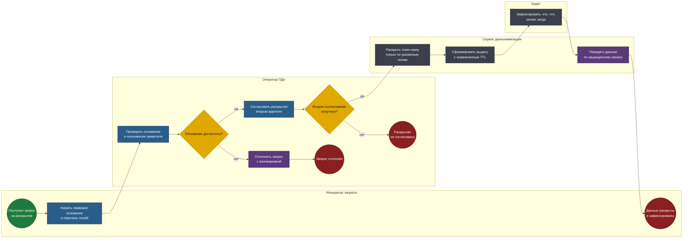

# BPMN 2.0 — Анонимизатор медицинских данных

Два процесса. Первый — массовый и автоматический: обезличивание документа по
запросу из МИС. Второй — редкий и намеренно неудобный: обратная
идентификация, единственный легальный способ связать обезличенный документ
с пациентом.

Исходники в нотации BPMN 2.0 — в [diagrams/](diagrams/). Схемы ниже
генерируются из тех же моделей.

## Соглашения нотации

| Элемент | Как читать |
|---|---|
| Дорожка (lane) | Кто владеет шагом: МИС, API-шлюз, NLP-пайплайн, оператор ПДн, хранилище |
| Прямоугольник | Задача: синяя — ручная, серая — автоматическая, фиолетовая — отправка сообщения |
| Ромб | Исключающий шлюз |
| Зелёный / красный круг | Стартовое и конечное события |

---

## 1. Обезличивание документа

Основной процесс. Запускается вызовом из медицинской информационной системы,
для врача происходит незаметно.

**Файл:** [`diagrams/01-anonymization.bpmn`](diagrams/01-anonymization.bpmn)

```mermaid
flowchart LR
    subgraph Lane_mis["МИС (система-источник)"]
        direction LR
        Start_doc(("Документ отправлен<br/>на обезличивание"))
        End_done(("Документ обезличен"))
    end
    subgraph Lane_api["API-шлюз"]
        direction LR
        T_auth["Аутентифицировать запрос:<br/>mTLS, токен, схема"]
        G_auth{"Запрос легитимен?"}
        T_reject["Вернуть 403<br/>и зафиксировать инцидент"]
        End_rejected(("Запрос отклонён"))
        T_return["Вернуть обезличенный<br/>документ в МИС"]
    end
    subgraph Lane_nlp["NLP-пайплайн"]
        direction LR
        T_extract["Извлечь текст:<br/>PDF / DOCX / HL7 / FHIR"]
        T_ner["Распознать ПДн: ФИО, даты,<br/>адреса, СНИЛС, полис"]
        T_classify["Классифицировать по ФЗ-152<br/>и HIPAA Safe Harbor"]
        G_conf{"Уверенность ≥ порога?"}
        T_mask["Маскировать и псевдонимизировать,<br/>сохранить токен-мапу"]
        T_recheck["Контрольный прогон:<br/>поиск остаточных ПДн"]
        G_residual{"Найдены остаточные ПДн?"}
    end
    subgraph Lane_dpo["Оператор ПДн"]
        direction LR
        T_manual["Верифицировать разметку<br/>вручную"]
        T_quarantine["Отправить в карантин<br/>на ручную обработку"]
        End_quarantine(("Документ в карантине"))
    end
    subgraph Lane_store["Хранилище и аудит"]
        direction LR
        T_store["Сохранить документ и токен-мапу<br/>в раздельных контурах"]
        T_audit["Записать событие<br/>в неизменяемый аудит-лог"]
    end
    Start_doc --> T_auth
    T_auth --> G_auth
    G_auth -- "да" --> T_extract
    G_auth -- "нет" --> T_reject
    T_reject --> End_rejected
    T_extract --> T_ner
    T_ner --> T_classify
    T_classify --> G_conf
    G_conf -- "да" --> T_mask
    G_conf -- "нет" --> T_manual
    T_manual --> T_mask
    T_mask --> T_recheck
    T_recheck --> G_residual
    G_residual -- "нет" --> T_store
    G_residual -- "да" --> T_quarantine
    T_quarantine --> End_quarantine
    T_store --> T_audit
    T_audit --> T_return
    T_return --> End_done
    classDef evStart fill:#1f7a3f,stroke:#0f4523,color:#ffffff
    classDef evEnd fill:#8a1f1f,stroke:#4a0f0f,color:#ffffff
    classDef gw fill:#e0a800,stroke:#8a6800,color:#1a1a1a
    classDef userTask fill:#2b5d8a,stroke:#143349,color:#ffffff
    classDef svcTask fill:#3a3f4b,stroke:#1b1e24,color:#ffffff
    classDef msgTask fill:#5a3a7a,stroke:#2e1c40,color:#ffffff
    class Start_doc evStart
    class T_auth,T_reject,T_extract,T_ner,T_classify,T_mask,T_recheck,T_store,T_audit svcTask
    class G_auth,G_conf,G_residual gw
    class End_rejected,End_quarantine,End_done evEnd
    class T_manual,T_quarantine userTask
    class T_return msgTask
```

<!-- diagram:01-anonymization -->

<!-- /diagram -->

### Решения, зашитые в модель

**Аутентификация — первый шаг, а не middleware в стороне от схемы.** В
процессе, где обрабатываются медицинские ПДн, проверка легитимности вызова
не деталь реализации, а бизнес-шаг с собственной веткой отказа и записью
инцидента. Отклонённый запрос попадает в аудит-лог наравне с успешным —
попытки неавторизованного доступа интересуют службу безопасности не меньше,
чем сами обращения.

**Порог уверенности модели ведёт к человеку, а не к автоматическому решению.**
Когда NER не уверен, система не выбирает между «замаскировать на всякий
случай» и «пропустить». Она отдаёт документ оператору ПДн. Это дороже, но
единственный честный вариант: обе автоматические стратегии дают либо утечку,
либо порчу данных, и ни одна не сообщает об этом наружу.

**Контрольный прогон ищет остаточные ПДн после маскирования.** Второй проход
по уже обезличенному тексту — не паранойя, а прямое следствие требования
99.9% полноты. Первый проход ищет сущности, второй проверяет результат: не
осталось ли идентификатора, который модель не увидела, но который находится
другим методом — по регулярным выражениям, словарям и контекстным правилам.

**Найденные остатки ведут в карантин, а не в повторное маскирование.** Если
контрольный прогон что-то нашёл, значит основной пайплайн ошибся. Автоматически
«дочистить» и выдать документ — значит замести под ковёр факт ошибки модели.
Документ уходит человеку, а случай становится материалом для дообучения.

**Документ и токен-мапа сохраняются в раздельные контуры.** Обезличенный
текст и таблица соответствия «токен → реальное значение» физически разнесены:
разные базы, разные права, разные ключи шифрования. Компрометация хранилища
обезличенных документов сама по себе не раскрывает ни одного пациента.

**Аудит-лог пишется до возврата результата.** Порядок шагов не случаен: если
запись в лог не удалась, документ не возвращается. Операция, которую нельзя
доказать, не должна считаться выполненной.

---

## 2. Обратная идентификация

Процесс существует, потому что деидентификация без возможности обратной связи
бесполезна в клинике: если исследование выявило критическую находку, пациента
нужно найти. Но каждый шаг спроектирован так, чтобы этот путь нельзя было
пройти незаметно.

**Файл:** [`diagrams/02-reidentification.bpmn`](diagrams/02-reidentification.bpmn)

<!-- diagram:02-reidentification -->

<!-- /diagram -->

### Решения, зашитые в модель

**Два согласования вместо одного (принцип «четырёх глаз»).** Первое —
проверка правового основания, второе — независимое подтверждение вторым
approver. Один скомпрометированный или недобросовестный сотрудник не может
раскрыть данные пациента. Обе проверки — отдельные шлюзы с отдельными
ветками отказа, а не чек-бокс в форме.

**Раскрываются только указанные в запросе поля.** Запрос на связь с лечащим
врачом не открывает адрес и полис. Токен-мапа раскрывается выборочно —
модель данных спроектирована так, чтобы это было технически возможно.

**Выдача имеет ограниченный срок жизни.** Раскрытые данные доступны заявителю
ограниченное время, после чего доступ закрывается автоматически. Разовое
основание не должно превращаться в постоянный доступ.

**Аудит-запись формируется до передачи данных.** Как и в первом процессе:
сначала фиксируем «кто, что, зачем, когда», потом отдаём. Обратный порядок
допускает раскрытие без следа при сбое.

**Отказ — тоже полноценный исход с записью.** Три конечных события: отклонён
по основанию, не согласован вторым approver, раскрыт. Все три попадают в
аудит. Отказы показывают давление на систему: кто и как часто пытается
получить доступ без оснований.

---

## Чего в моделях сознательно нет

- **Обучения и дообучения модели** — отдельный контур с собственным
  процессом разметки; он не должен быть частью боевого пайплайна обработки.
- **Экспорта датасетов для исследователей** — обезличенный документ и
  исследовательская выгрузка живут по разным правилам агрегации и
  k-анонимности; смешивать их в одном процессе некорректно.
- **Согласия пациента на обработку** — фиксируется в МИС до обращения к
  сервису, находится вне границ системы.

---

## Как открыть исходники

```bash
open https://demo.bpmn.io/          # перетащить .bpmn в окно
brew install --cask camunda-modeler # десктопный редактор
```

Перегенерация после правки моделей:

```bash
python3 tools/build_diagrams.py
```
