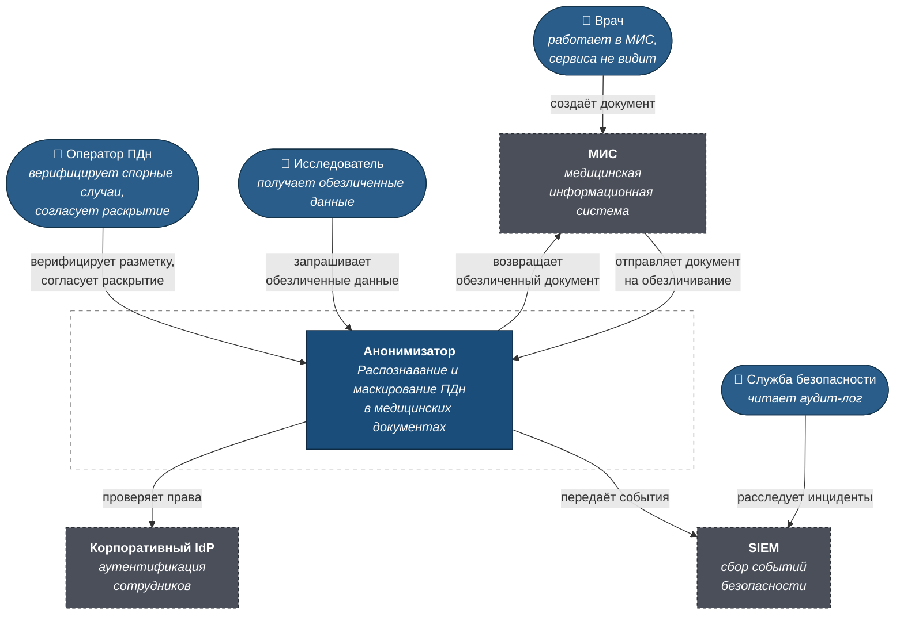
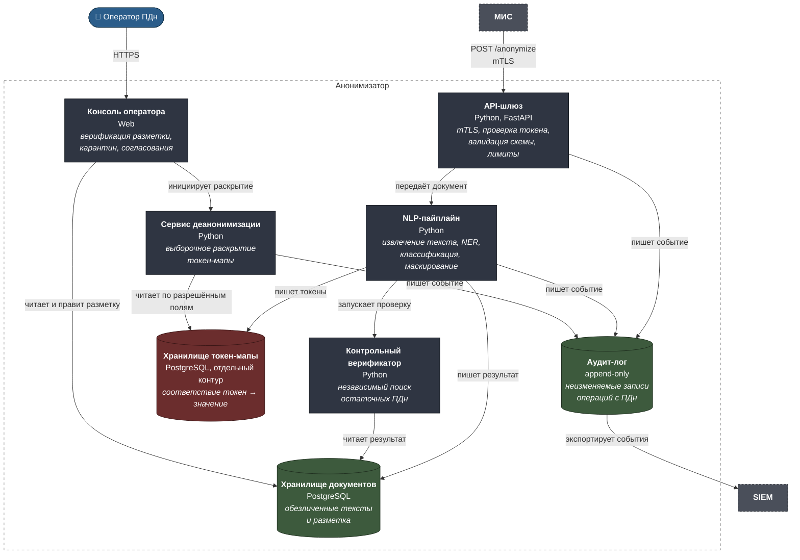
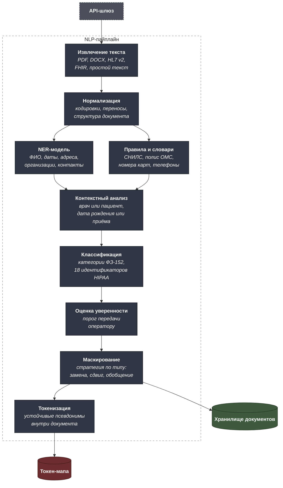
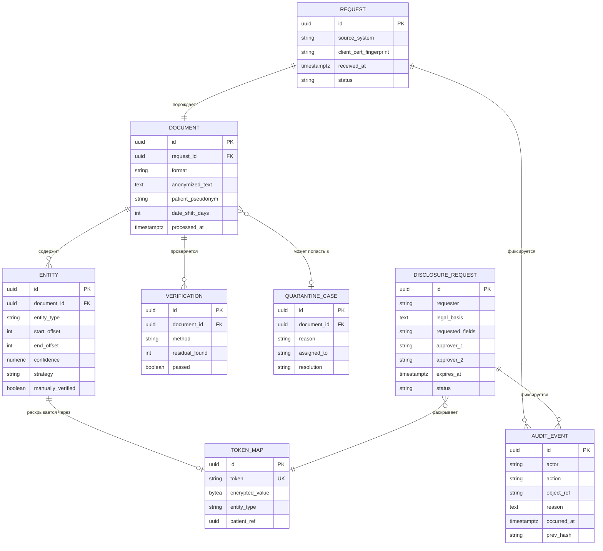

# C4 — Анонимизатор медицинских данных

Три уровня модели C4, модель данных и разделение контуров хранения.
Машиночитаемый исходник — [`c4/workspace.dsl`](c4/workspace.dsl).

---

## Уровень 1. Контекст системы



### Границы системы

**В скоупе:** приём документа из МИС, распознавание и классификация ПДн,
маскирование и псевдонимизация, контрольная проверка результата, карантин,
хранение токен-мапы, аудит, обратная идентификация по обоснованному запросу.

**Вне скоупа:** сбор согласия пациента на обработку (фиксируется в МИС до
обращения к сервису), обучение и дообучение NLP-моделей (отдельный контур с
собственным процессом разметки), формирование исследовательских датасетов с
агрегацией и k-анонимностью (другие правила, другой процесс).

**Ключевое свойство контекста: врач не взаимодействует с системой напрямую.**
Требование «встроиться в существующий документооборот» означает, что рабочий
процесс врача не меняется вообще — обезличивание происходит на стороне МИС по
API. Любой сценарий, где врач должен что-то нажать, нарушает цель проекта.

---

## Уровень 2. Контейнеры



### Три контура хранения

Красным на схеме выделено хранилище токен-мапы — единственное место в
системе, где обезличенные данные можно связать с реальным пациентом.
Разделение контуров — не архитектурная эстетика, а способ ограничить
последствия компрометации.

| Контур | Что хранит | Кто имеет доступ | Что даёт компрометация |
|---|---|---|---|
| Документы | Обезличенные тексты, разметку, метаданные | Пайплайн, консоль оператора, исследователи через выгрузку | Тексты без идентификаторов — сами по себе не ПДн |
| Токен-мапа | Соответствие «токен → реальное значение» | Только сервис деанонимизации, только по согласованному запросу | Прямое раскрытие пациентов — поэтому отдельный ключ, отдельная сеть, отдельные права |
| Аудит | Кто, что, когда и на каком основании делал | Служба безопасности на чтение; запись — только append | Знание о действиях, но не сами данные |

**Верификатор намеренно не переиспользует код пайплайна.** Если бы
контрольный прогон использовал ту же модель и те же правила, он повторял бы
её ошибки и всегда возвращал «чисто». Независимость метода — условие
осмысленности проверки: пайплайн опирается на нейросетевой NER, верификатор —
на регулярные выражения, словари и контекстные правила.

---

## Уровень 3. Компоненты NLP-пайплайна



### Стратегии маскирования по типам идентификаторов

Единая стратегия «заменить всё на `[СКРЫТО]`» уничтожает данные. Разные типы
идентификаторов требуют разного обращения — это ключевое проектное решение,
от которого зависит, останутся ли данные пригодными для исследований.

| Тип | Стратегия | Почему так |
|---|---|---|
| ФИО пациента | Устойчивый псевдоним в пределах документа | «Иванов» в анамнезе и «Иванову» в назначении — один человек; связность текста должна сохраниться |
| ФИО врача | Замена на роль («лечащий врач») | Врач — не субъект исследования, но его специальность может быть значима |
| Дата рождения | Сдвиг всех дат пациента на единый случайный интервал | Возраст и интервалы между событиями сохраняются, конкретная дата — нет |
| Даты приёмов и процедур | Тот же сдвиг, что и дата рождения | Иначе рассыпается хронология лечения |
| Возраст старше 89 лет | Обобщение до «90+» | Прямое требование HIPAA Safe Harbor: в этой группе возраст сам по себе идентифицирует |
| Адрес | Обобщение до региона | Регион нужен для эпидемиологии, дом и квартира — нет |
| СНИЛС, полис, номер карты | Полная замена на токен | Прямые идентификаторы без исследовательской ценности |
| Телефон, e-mail | Полное удаление | Контактные данные не нужны в обезличенном документе ни при каком сценарии |
| Редкий диагноз | Флаг на ручную проверку | Само заболевание может идентифицировать пациента в малой популяции — машина этого не решает |

**Сдвиг дат единый для пациента, а не для документа.** Если каждый документ
сдвигать независимо, разрушается хронология между документами одного
пациента. Величина сдвига хранится в токен-мапе вместе с остальными
соответствиями.

---

## Модель данных



**`AUDIT_EVENT.prev_hash` делает лог неизменяемым по построению.** Каждая
запись содержит хеш предыдущей — цепочка. Удалить или отредактировать
запись задним числом нельзя, не сломав все последующие. Это дешевле
специализированного WORM-хранилища и достаточно, чтобы факт вмешательства
был обнаружим.

**`ENTITY` хранит смещения, а не сами значения.** В хранилище документов не
должно быть ни одного фрагмента исходных персональных данных — даже в
служебных полях разметки. Соответствие «токен → значение» живёт только в
зашифрованном виде в отдельном контуре.

**`TOKEN_MAP.patient_ref` позволяет выборочное раскрытие.** Запрос на связь с
лечащим врачом раскрывает одно поле, а не весь профиль пациента. Без этой
связи пришлось бы раскрывать токен-мапу документа целиком.

---

## Как открыть DSL

```bash
docker run -it --rm -p 8080:8080 \
  -v "$PWD/projects/03-medical-anonymizer/c4:/usr/local/structurizr" \
  structurizr/lite
```
