# User Flow — Fantasy Football

Поток построен в трёх свимлейнах: действия пользователя, реакция бэкенда и
события внешнего поставщика спортивных данных. Такое разделение сразу
показывает, где продукт зависит от того, чем не управляет.

## Схема потока

Пунктиром — асинхронные связи и потоки данных, сплошным — переходы
пользователя.

```mermaid
flowchart LR
    subgraph U["Пользователь"]
        direction LR
        reg["Регистрация"]
        teams["Выбор любимых команд"]
        auth["Авторизация"]
        field["Футбольное поле"]
        catalog["Каталог игроков"]
        filter["Фильтр / сортировка / поиск"]
        add["Добавить игрока<br/>(или автоподбор)"]
        captain["Назначить капитана"]
        confirm["Утвердить состав"]
        points["Просмотр очков"]
        global["Глобальная таблица"]
        league["Мини-лига"]
        updated["Место в таблице<br/>обновлено"]
    end

    subgraph B["Бэкенд"]
        direction LR
        account["Создание аккаунта<br/>email / телефон / VK"]
        notify1["Уведомление<br/>email / SMS"]
        playerlist["Список игроков:<br/>имя, клуб, позиция, цена"]
        budget["Проверка бюджета<br/>и лимитов по клубу"]
        squad["Состав сохранён:<br/>15 игроков зафиксировано"]
        calc["Расчёт очков"]
        award["Начисление очков"]
        tables["Обновление таблиц"]
        notify2["Уведомление"]
    end

    subgraph E["Внешний сервис"]
        direction LR
        kickoff["Матч начался"]
        matchdata["Данные матча:<br/>голы, передачи, карточки"]
    end

    reg --> teams --> auth --> field --> catalog --> filter --> add
    add --> captain --> confirm --> points --> global --> league
    reg --> account
    auth --> notify1
    playerlist -.-> filter
    add --> budget
    confirm --> squad
    squad -.->|"данные тура<br/>в реальном времени"| kickoff
    kickoff --> matchdata
    matchdata --> calc
    calc --> award
    award --> tables
    award -.-> notify2
    tables --> updated

    classDef user fill:#2b5d8a,stroke:#143349,color:#fff
    classDef back fill:#3a3f4b,stroke:#1b1e24,color:#fff
    classDef ext fill:#5a3a3a,stroke:#2e1c1c,color:#fff
    class reg,teams,auth,field,catalog,filter,add,captain,confirm,points,global,league,updated user
    class account,notify1,playerlist,budget,squad,calc,award,tables,notify2 back
    class kickoff,matchdata ext
```

## Что схема зафиксировала точно

**Разделение «действие пользователя / реакция системы».** Каждый пользовательский
шаг связан с тем, что происходит на бэкенде. Это не декоративная деталь:
«Добавить игрока» выглядит как одно нажатие, но за ним стоит проверка бюджета
и лимита игроков из одного клуба — то самое место, где абстрактные правила
игры превращаются в конкретное ограничение интерфейса.

**Точка фиксации состава.** Узел «Состав сохранён: 15 игроков зафиксировано»
разделяет флоу на две принципиально разные части. До него пользователь
управляет всем, после — только наблюдает. Это граница транзакции в
продуктовом смысле.

**Честно обозначенная зависимость от внешнего сервиса.** Подпись на связи —
«предполагается, что мы сможем получать данные в реальном времени по ходу
матча и обновлять их в приложении» — это ровно то, как и надо фиксировать
допущение на этапе проектирования. Слово «предполагается»
означает, что контракт с поставщиком данных ещё не подтверждён, а вся
ценность продукта висит на этой стрелке.

## Пробелы, которые схема обнажает

Хорошая схема ценна не только тем, что показывает, но и тем, какие вопросы
делает очевидными. Ниже — то, что осталось за её пределами; каждый пункт стал
отдельной историей или сценарием в документации.

**Дедлайн тура отсутствует как узел.** «Утвердить состав» есть, а момента,
после которого состав менять нельзя, — нет. Между тем это центральное правило
жанра: без дедлайна пользователь дособирает состав после первого гола.
См. [UC-03](use-cases.md#uc-03--фиксация-состава-и-дедлайн-тура).

**Нет трансферов между турами.** Схема описывает первую сборку состава.
Но фэнтези-футбол — это сезонная игра: между турами разрешено ограниченное
число замен, за превышение начисляется штраф. Второй и последующие туры
проходят по другому маршруту, которого на схеме нет.

**Не описано, что происходит при переносе или отмене матча.** Внешний сервис
на схеме умеет только «Матч начался». Реальность богаче: матч переносят,
отменяют, доигрывают. Очки за перенесённый матч начисляются позже — значит,
таблица меняется задним числом.

**Не учтены ретроспективные правки статистики.** Гол переписывают на другого
игрока, автогол пересматривают, карточку отменяют. Поставщики данных
присылают корректировки после матча. Схема предполагает, что «Расчёт очков»
происходит один раз — на практике он должен быть пересчитываемым.

**Нет ветки отказа внешнего сервиса.** Если поставщик недоступен во время
тура, продукт теряет единственную функцию, ради которой им пользуются
в эти два часа. Нужны кэш последнего состояния, честный индикатор задержки
и, желательно, резервный источник.

**Капитан не сыграл — что тогда?** Стандартное правило жанра — вице-капитан,
которого на схеме нет. Без него пользователь, чей капитан не вышел на поле,
теряет удвоение без всякой альтернативы.

**Изменение цены игрока не обработано.** Цены в фэнтези плавают в зависимости
от популярности игрока. Что происходит с уже собранным составом, если игрок
подорожал, — схема не отвечает.

**Мини-лига появляется как экран, но не как процесс.** Кто её создаёт, как
приглашает друзей, что происходит при выходе участника — всё это за кадром.

## Как пробелы отражены в документации

| Пробел | Где закрыт |
|---|---|
| Дедлайн тура | [UC-03](use-cases.md#uc-03--фиксация-состава-и-дедлайн-тура), [US-03.1](user-stories.md#us-031--дедлайн-тура) |
| Трансферы между турами | [UC-04](use-cases.md#uc-04--трансферы-между-турами), [US-03.2](user-stories.md#us-032--трансферы-и-штрафы) |
| Перенос и отмена матча | [UC-05](use-cases.md#uc-05--начисление-очков-по-ходу-матча) E2 |
| Ретроспективные правки | [UC-06](use-cases.md#uc-06--пересчёт-очков-после-корректировки-статистики) |
| Отказ поставщика данных | [UC-05](use-cases.md#uc-05--начисление-очков-по-ходу-матча) E1, [US-04.3](user-stories.md#us-043--поведение-при-недоступности-данных) |
| Вице-капитан | [US-02.4](user-stories.md#us-024--капитан-и-вице-капитан) |
| Изменение цены игрока | [US-01.4](user-stories.md#us-014--динамические-цены-игроков) |
| Мини-лиги как процесс | [UC-07](use-cases.md#uc-07--создание-и-ведение-мини-лиги), эпик [EP-05](user-stories.md#ep-05-мини-лиги-и-социальный-контур) |
