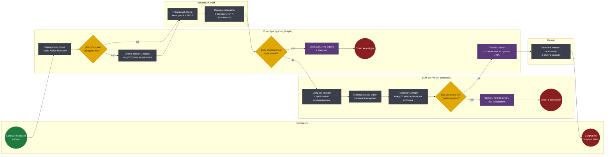

# BPMN 2.0 — Enterprise AI-помощники

Две модели по двум самым нагруженным продуктам программы. Обе построены
вокруг одного принципа: система обязана явно показывать, на чём основано
её решение, и обязана уметь сказать «не знаю».

Исходники — в [diagrams/](diagrams/). Схемы генерируются из тех же моделей.

## Соглашения нотации

| Элемент | Как читать |
|---|---|
| Дорожка (lane) | Кто владеет шагом: сотрудник, оркестратор, поисковый слой, LLM-контур, эксперт |
| Прямоугольник | Задача: синяя — ручная, серая — автоматическая, фиолетовая — отправка сообщения |
| Ромб | Исключающий шлюз |
| Зелёный / красный круг | Стартовое и конечное события |

---

## 1. Ответ на вопрос по нормативной базе

Сотрудник спрашивает на естественном языке — система отвечает со ссылками
на конкретные пункты локальных нормативных актов.

**Файл:** [`diagrams/01-rag-query.bpmn`](diagrams/01-rag-query.bpmn)

<!-- diagram:01-rag-query -->

<!-- /diagram -->

### Решения, зашитые в модель

**Права доступа проверяются до поиска, а не при выдаче ответа.** Часть
нормативных актов доступна не всем: документы по тарифообразованию или
внутренним расследованиям видит ограниченный круг. Если проверять права
после генерации, модель уже прочитала закрытый документ и может пересказать
его содержимое, формально не процитировав. Область поиска сужается до
разрешённых документов ещё на входе.

**Гибридный поиск, а не только векторный.** Векторный поиск отлично
находит смысловые совпадения и стабильно проваливается на точных
идентификаторах: номер приказа, код продукта, артикул формы. Полнотекстовый
BM25 делает обратное. В нормативной базе запросы бывают обоих типов —
«что делать при отказе в выплате» и «что говорит приказ 114-П», — поэтому
работают оба механизма, а результаты объединяются переранжированием.

**Шлюз «Есть релевантные фрагменты?» существует, чтобы система могла
сказать «не знаю».** Без него LLM всегда что-нибудь ответит — и на вопрос,
ответа на который в базе нет, сгенерирует правдоподобный вымысел. Для
нормативной базы это худший из возможных исходов: сотрудник поверит и
сошлётся на несуществующий пункт.

**Проверка опоры на источник — отдельный шаг после генерации.** Модель
может сослаться на реальный документ и при этом приписать ему утверждение,
которого там нет. Шаг сверяет каждое утверждение ответа с найденными
фрагментами; неподтверждённое обобщение не выдаётся как факт — пользователь
получает цитаты и делает вывод сам.

**Журнал пишется до показа ответа.** В регулируемой отрасли важно не
только что ответила система, но и на основании каких редакций документов:
через полгода при разборе спорного случая нужно восстановить, какая
редакция ЛНА действовала на момент запроса.

---

## 2. Согласование медицинского назначения

Клиника присылает протокол назначений, система проверяет его на
соответствие клиническим рекомендациям и условиям полиса.

**Файл:** [`diagrams/02-medical-approval.bpmn`](diagrams/02-medical-approval.bpmn)

```mermaid
flowchart LR
    subgraph Lane_clinic["Клиника"]
        direction LR
        Start_protocol(("Клиника прислала<br/>протокол назначения"))
        End_done(("Клиника<br/>получила решение"))
    end
    subgraph Lane_ocr["Распознавание документа"]
        direction LR
        T_ocr["Распознать документ<br/>с сохранением структуры"]
        T_ner["Извлечь диагнозы,<br/>услуги, назначения"]
        G_quality{"Качество распознавания<br/>достаточное?"}
    end
    subgraph Lane_rules["Клинический движок"]
        direction LR
        T_map["Сопоставить с МКБ-10<br/>и клиническими рекомендациями"]
        T_check["Проверить назначение<br/>по правилам и полису"]
        G_verdict{"Соответствует<br/>правилам?"}
        T_approve["Сформировать решение<br/>о согласовании"]
        T_reject["Сформировать<br/>мотивированный отказ"]
    end
    subgraph Lane_expert["Врач-эксперт"]
        direction LR
        T_manual_read["Прочитать документ<br/>вручную"]
        T_expert["Передать случай<br/>врачу-эксперту"]
        T_decide["Принять решение<br/>по спорному случаю"]
    end
    subgraph Lane_reg["Учётная система"]
        direction LR
        T_record["Зафиксировать решение<br/>и обоснование"]
        T_notify["Отправить решение<br/>в клинику"]
    end
    Start_protocol --> T_ocr
    T_ocr --> T_ner
    T_ner --> G_quality
    G_quality -- "да" --> T_map
    G_quality -- "нет" --> T_manual_read
    T_manual_read --> T_map
    T_map --> T_check
    T_check --> G_verdict
    G_verdict -- "да" --> T_approve
    G_verdict -- "нет" --> T_reject
    G_verdict -- "спорно" --> T_expert
    T_expert --> T_decide
    T_approve --> T_record
    T_reject --> T_record
    T_decide --> T_record
    T_record --> T_notify
    T_notify --> End_done
    classDef evStart fill:#1f7a3f,stroke:#0f4523,color:#ffffff
    classDef evEnd fill:#8a1f1f,stroke:#4a0f0f,color:#ffffff
    classDef gw fill:#e0a800,stroke:#8a6800,color:#1a1a1a
    classDef userTask fill:#2b5d8a,stroke:#143349,color:#ffffff
    classDef svcTask fill:#3a3f4b,stroke:#1b1e24,color:#ffffff
    classDef msgTask fill:#5a3a7a,stroke:#2e1c40,color:#ffffff
    class Start_protocol evStart
    class T_ocr,T_ner,T_map,T_check,T_approve,T_reject,T_record svcTask
    class G_quality,G_verdict gw
    class T_manual_read,T_decide userTask
    class T_expert,T_notify msgTask
    class End_done evEnd
```

<!-- diagram:02-medical-approval -->

<!-- /diagram -->

### Решения, зашитые в модель

**Шлюз «Соответствует правилам?» имеет три ветки, а не две.** Согласовано,
отказано и «спорно» — принципиально разные исходы. Бинарная логика в
медицинском согласовании означает, что в неоднозначном случае автомат
обязан выбрать: либо согласовать лишнее, либо отказать в нужном лечении.
Третья ветка — единственный честный вариант, и она ведёт к живому врачу.

**Отказ формирует движок правил, а не модель.** Мотивированный отказ — это
юридически значимый документ: он должен ссылаться на конкретный пункт
клинической рекомендации или условие полиса. Генеративная модель здесь
работает на извлечение и сопоставление, а решение принимает
детерминированная логика на графе знаний. Это же обеспечивает
воспроизводимость: один и тот же протокол всегда даёт один и тот же ответ.

**Плохое распознавание уходит к человеку, а не в отказ.** Клиники
присылают сканы разного качества, часть — с рукописными пометками. Отказ
по причине «не смогли прочитать» перекладывает проблему на пациента.
Шлюз качества направляет такие протоколы врачу-эксперту на ручное чтение,
и дальше они идут по общему маршруту.

**Решение фиксируется до отправки в клинику.** Порядок «записать, потом
отправить» гарантирует, что не возникнет отправленного решения, которого
нет в учётной системе, — иначе при споре клиника предъявит ответ, которого
у страховой не существует.

---

## Что модели не покрывают

- **Обучение и дообучение моделей** — отдельный контур с процессом
  разметки и валидации; в боевом пайплайне ему не место.
- **Загрузка и версионирование нормативной базы** — процесс индексации
  живёт отдельно и запускается по событию публикации новой редакции ЛНА.
- **Два оставшихся продукта программы** — проверка контрагентов и помощник
  по закупкам описаны в [use-cases.md](use-cases.md), но BPMN-модели по ним
  в портфолио не вынесены: они повторяют структуру «оркестратор коннекторов
  → скоринг → отчёт» без новых проектных решений.
