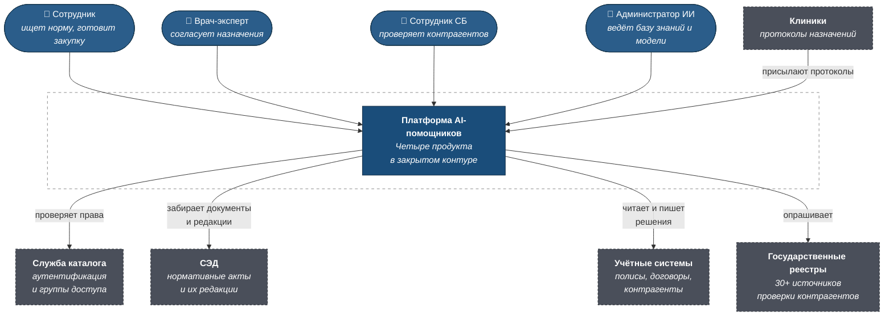
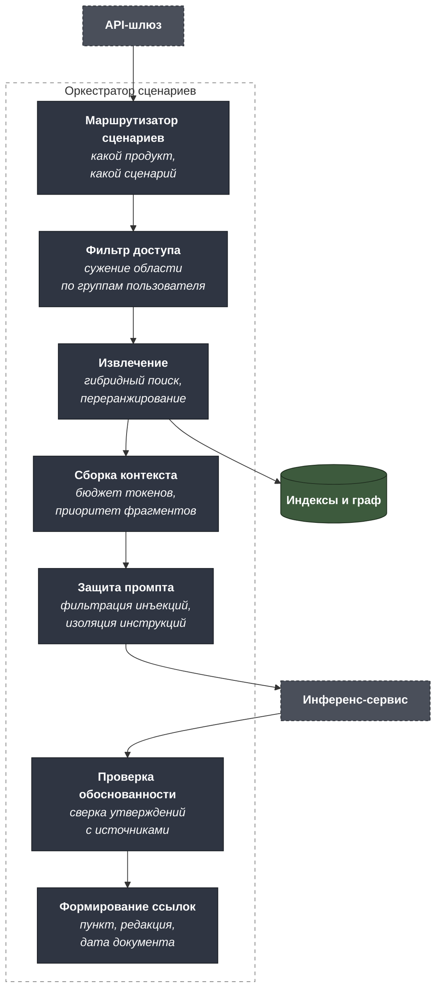
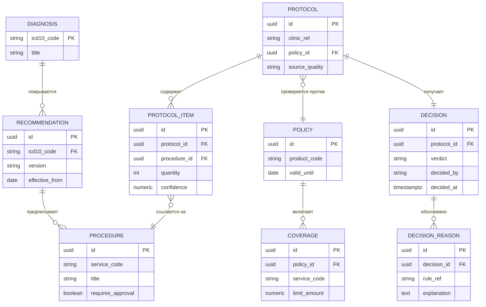

# C4 — Enterprise AI-помощники

Архитектура программы из четырёх продуктов на общей платформе.
Машиночитаемый исходник — [`c4/workspace.dsl`](c4/workspace.dsl).

---

## Уровень 1. Контекст



### Главная граница системы

Через границу контура **не проходит ни один запрос к внешнему ИИ-сервису**.
Все модели работают локально. Это ограничение определило три следствия,
проходящие через всю архитектуру:

- модели выбираются из open-source с приемлемой лицензией, а не «лучшие
  по бенчмаркам»;
- ёмкость планируется заранее — нельзя докупить токенов, можно только
  докупить видеопамять;
- качество на доменной лексике вытягивается дообучением и инженерией
  контекста, а не сменой поставщика.

---

## Уровень 2. Контейнеры

```mermaid
flowchart TB
    employee(["👤 Сотрудник"])
    doctor(["👤 Врач-эксперт"])
    registries["<b>Гос. реестры</b>"]
    docflow["<b>СЭД</b>"]

    subgraph sys["Платформа AI-помощников"]
        ui["<b>Единый веб-интерфейс</b><br/>SPA<br/><i>четыре продукта,<br/>общая авторизация</i>"]
        gw["<b>API-шлюз</b><br/><i>аутентификация,<br/>квоты, аудит</i>"]
        orch["<b>Оркестратор сценариев</b><br/>агентный фреймворк<br/><i>шаги, инструменты,<br/>ветвление</i>"]
        infer["<b>Инференс-сервис</b><br/>GPU-кластер<br/><i>локальные LLM,<br/>очередь запросов</i>"]
        index["<b>Служба индексации</b><br/><i>парсинг, OCR, нарезка,<br/>эмбеддинги</i>"]
        vector[("<b>Векторная база</b><br/><i>фрагменты документов</i>")]
        fts[("<b>Полнотекстовый индекс</b><br/><i>точные совпадения</i>")]
        graph[("<b>Граф знаний</b><br/><i>МКБ-10, клинические<br/>рекомендации</i>")]
        rules["<b>Движок правил</b><br/><i>детерминированные<br/>клинические проверки</i>"]
        connectors["<b>Коннекторы реестров</b><br/><i>30+ источников,<br/>нормализация ответов</i>"]
        audit[("<b>Журнал</b><br/><i>запросы, источники,<br/>решения</i>")]
    end

    employee --> ui
    doctor --> ui
    ui -- "REST" --> gw
    gw --> orch
    orch -- "промпт и контекст" --> infer
    orch -- "поиск" --> vector
    orch -- "поиск" --> fts
    orch -- "проверка правил" --> rules
    rules -- "запрос онтологии" --> graph
    orch -- "опрос источников" --> connectors
    connectors --> registries
    index -- "забирает документы" --> docflow
    index -- "пишет фрагменты" --> vector
    index -- "пишет термины" --> fts
    gw -- "пишет событие" --> audit
    orch -- "пишет источники" --> audit

    classDef person fill:#2b5d8a,stroke:#143349,color:#fff
    classDef container fill:#2f3542,stroke:#171b21,color:#fff
    classDef store fill:#3d5a3d,stroke:#1e2d1e,color:#fff
    classDef ext fill:#4a4f5a,stroke:#2a2e35,color:#fff,stroke-dasharray:4 3
    class employee,doctor person
    class ui,gw,orch,infer,index,rules,connectors container
    class vector,fts,graph,audit store
    class registries,docflow ext
    style sys fill:none,stroke:#888,stroke-dasharray:5 5
```

### Почему так

**Инференс — отдельный контейнер с очередью.** GPU в закрытом контуре
конечны и дороги. Если каждый продукт обращается к модели напрямую,
тяжёлый запрос помощника по закупкам с длинным контекстом блокирует
быстрые запросы к нормативной базе. Общая очередь с приоритетами
превращает конкуренцию за ресурс в управляемое ограничение.

**Индексация отделена от поиска.** Обработка двух тысяч документов, из
которых 70% — сканы, идёт часами. Это фоновый процесс с собственным
темпом, который не должен ни блокировать поиск, ни падать вместе с ним.
Публикация новой редакции ЛНА запускает переиндексацию только этого
документа.

**Движок правил вынесен из LLM-контура.** Ключевое архитектурное решение
медицинского продукта: генеративная модель извлекает сущности из
документа, но не принимает решение о согласовании. Решение принимает
детерминированная логика на графе знаний — потому что оно должно быть
воспроизводимым, объяснимым и защищаемым в споре с клиникой.

**Два индекса вместо одного.** Векторный и полнотекстовый решают разные
задачи и оба нужны — обоснование в [bpmn.md](bpmn.md).

---

## Уровень 3. Компоненты оркестратора



**Защита промпта — обязательный компонент, а не опция.** В нормативной
базе лежат документы, которые писали люди, и туда может попасть текст,
который модель прочитает как инструкцию. Найденный фрагмент — это данные,
а не команда; компонент изолирует их друг от друга. Подробнее —
[threat-model.md](threat-model.md).

---

## Модель знаний медицинского продукта



**`RECOMMENDATION.effective_from` — не украшение.** Клинические
рекомендации обновляются, и протокол должен проверяться против редакции,
действовавшей на дату назначения, а не на дату проверки. Без версионности
пересмотр рекомендаций задним числом превратил бы согласованные протоколы
в несогласованные.

**`DECISION_REASON` отделено от `DECISION`.** Одно решение опирается на
несколько правил, и в мотивированном отказе должны быть перечислены все.
Хранить обоснование текстовым полем внутри решения — значит через год не
суметь ответить, какие протоколы отклонены по конкретному правилу, когда
это правило признают ошибочным.

---

## Сравнение моделей: критерии выбора

Для on-premises нельзя «попробовать и переключиться» — выбор фиксируется
закупкой оборудования. Матрица, по которой принималось решение:

| Критерий | Почему важен в закрытом контуре |
|---|---|
| Лицензия | Коммерческое использование должно быть разрешено явно; ограничения по числу пользователей блокируют внедрение |
| Качество на русском в домене | Общие бенчмарки не отражают страховую и медицинскую лексику — оценка только на своём корпусе |
| Требования к видеопамяти | Определяет стоимость оборудования; модель, требующая вдвое больше GPU, дороже пожизненно, а не разово |
| Длина контекста | Помощнику по закупкам нужно держать пакет документов целиком, иначе аудит распадается на несмежные куски |
| Поддержка дообучения | Медицинский продукт без адаптации на доменных данных не достигает целевой точности |
| Скорость генерации | Влияет на то, сколько одновременных пользователей выдержит один GPU |
| Активность сообщества | Заброшенная модель — это отсутствие исправлений уязвимостей на горизонте эксплуатации |

Практический вывод: под четыре продукта не берётся одна модель. Поиск по
нормативной базе и аудит закупок требуют длинного контекста и хорошего
русского; медицинский продукт — доменной адаптации; извлечение сущностей
эффективнее решается специализированной моделью, а не генеративной.
Инференс-сервис спроектирован как мультимодельный именно поэтому.

---

## Как открыть DSL

```bash
docker run -it --rm -p 8080:8080 \
  -v "$PWD/projects/05-enterprise-ai-assistants/c4:/usr/local/structurizr" \
  structurizr/lite
```
