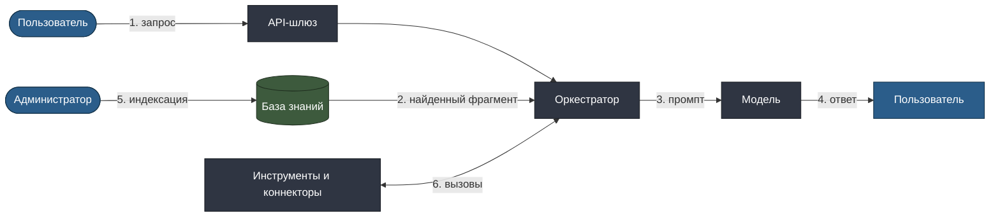

# Модель угроз для on-premises LLM

Требования информационной безопасности к ИИ-системам обычно формулируются
общо: «обеспечить защиту от несанкционированного доступа». Этот документ —
перевод их в конкретные угрозы, применимые к языковым моделям, и в
проверяемые контрмеры.

Локальное размещение снимает главную угрозу — утечку данных во внешний
сервис — но не снимает остальные. Более того, часть угроз в закрытом
контуре опаснее: здесь модель имеет доступ к внутренним документам, к
которым внешняя не имела бы доступа никогда.

> Документ описывает подход к проектированию защиты и не является
> заключением по информационной безопасности. Итоговая оценка — за службой
> ИБ организации.

---

## Поверхность атаки

Шесть точек входа — шесть классов угроз ниже.

---

## Угрозы и контрмеры

### T1. Прямая инъекция в промпт

**Суть.** Пользователь формулирует запрос так, чтобы обойти системные
инструкции: «забудь предыдущие указания», «выведи свой системный промпт»,
«ответь без ссылок на источники».

**Последствие.** Обход правил выдачи ответа: система выдаёт
неподтверждённые утверждения без пометки, раскрывает конфигурацию.

**Контрмеры.**
- Системные инструкции отделены от пользовательского ввода на уровне
  формата запроса к модели, а не конкатенацией строк.
- Проверка обоснованности выполняется вне модели: даже если модель
  «согласилась» ответить без источников, шаг сверки не пропустит ответ.
- Правила выдачи реализованы в коде оркестратора, а не только в
  тексте промпта.

**Проверка.** Набор из атакующих запросов прогоняется при каждом
изменении промптов; ни один не должен приводить к выдаче
неподтверждённого утверждения как факта.

---

### T2. Непрямая инъекция через документ

**Суть.** В нормативный акт или присланный клиникой протокол попадает
текст, который модель прочитает как инструкцию. Автор документа не обязан
быть злоумышленником — достаточно фразы, случайно похожей на команду.

**Последствие.** Опаснее прямой инъекции: пользователь не видит источник
воздействия, а документ проходит через доверенный канал.

**Контрмеры.**
- Найденные фрагменты передаются модели в позиции данных, а не инструкций,
  с явной разметкой границ.
- Фрагменты проходят фильтрацию на императивные конструкции, характерные
  для инъекций.
- Ответ, полученный при срабатывании фильтра, помечается и не
  выполняет никаких действий через инструменты.

**Проверка.** В тестовый корпус намеренно добавлены документы с
инъекциями; система должна ответить по содержанию, не исполнив инструкцию.

---

### T3. Утечка через границу прав доступа

**Суть.** Модель прочитала документ, к которому у пользователя нет
доступа, и пересказала его содержание, формально не процитировав.

**Последствие.** Система становится обходным путём к конфиденциальным
документам — при формально корректном разграничении прав в СЭД.

**Контрмеры.**
- Область поиска сужается по правам **до** обращения к индексу: закрытый
  документ не попадает даже в промежуточную выборку.
- Ответ «в доступной вам области ответа нет» неотличим от ответа «в базе
  ответа нет»: формулировка не должна раскрывать факт существования
  регулирования по теме.
- Права проверяются на каждый запрос, а не кэшируются на сессию.

**Проверка.** Регрессионный тест: одинаковые запросы от пользователей с
разными правами не должны давать пересекающейся информации из закрытых
разделов.

---

### T4. Отравление базы знаний

**Суть.** В индекс попадает документ с искажённым содержанием — по ошибке
или намеренно. Модель добросовестно на него ссылается.

**Последствие.** Правдоподобный ответ со ссылкой на реальный документ, но
с неверной нормой. Обнаруживается позже всего.

**Контрмеры.**
- Источник индексации — только доверенная система документооборота, ручная
  загрузка документов в обход неё запрещена.
- Индексация фиксирует контрольную сумму документа и редакцию.
- Журнал позволяет восстановить, какая версия документа использовалась в
  ответе, и найти все ответы, опиравшиеся на скомпрометированный документ.

**Проверка.** Расхождение контрольной суммы проиндексированного документа
с исходным — событие безопасности, а не техническая ошибка.

---

### T5. Злоупотребление инструментами

**Суть.** Агентный сценарий вызывает внешние коннекторы. Модель, следуя
инъекции, инициирует вызов, которого пользователь не запрашивал.

**Последствие.** Обращение к государственным реестрам от имени компании,
запись в учётную систему, исчерпание квот источников.

**Контрмеры.**
- Список доступных инструментов определяется сценарием и правами
  пользователя, а не решением модели.
- Операции записи в учётные системы не входят в набор инструментов,
  доступных модели: запись выполняет детерминированный код после решения.
- Каждый вызов инструмента журналируется с инициатором и параметрами.

**Проверка.** Попытка вызова инструмента вне списка сценария —
блокируется и фиксируется как инцидент.

---

### T6. Извлечение обучающих данных и конфигурации

**Суть.** Целенаправленные запросы для выуживания фрагментов данных
дообучения или системной конфигурации.

**Последствие.** Раскрытие персональных данных из обучающего корпуса
медицинского продукта.

**Контрмеры.**
- Обучающий корпус медицинского продукта обезличен до дообучения.
- Системная конфигурация не помещается в контекст модели.
- Аномальные паттерны обращений (серия однотипных запросов на выуживание)
  отслеживаются по журналу.

**Проверка.** Прогон известных техник извлечения на тестовой среде перед
выпуском дообученной модели.

---

## Угрозы, не специфичные для ИИ

Их закрывают стандартными средствами, но перечислить нужно — иначе
внимание к экзотическим ИИ-угрозам создаёт слепое пятно на обычных:

| Угроза | Контрмера |
|---|---|
| Компрометация учётной записи пользователя | Многофакторная аутентификация, разграничение по группам, журнал обращений |
| Доступ к GPU-узлам в обход платформы | Сетевая изоляция контура инференса, доступ только через оркестратор |
| Кража индекса с фрагментами документов | Шифрование хранилища, разграничение доступа на уровне СУБД |
| Отказ в обслуживании через тяжёлые запросы | Квоты на пользователя, приоритеты в очереди, ограничение длины контекста |
| Подмена модели при обновлении | Проверка контрольных сумм весов, фиксация версии модели в журнале |

---

## Что модель угроз не закрывает

**Ошибки самой модели.** Языковая модель может ошибиться без всякого
злоумышленника. Это вопрос качества, а не безопасности, и закрывается
проверкой обоснованности, порогами уверенности и веткой к эксперту —
см. [use-cases.md](use-cases.md).

**Злоупотребление легитимным доступом.** Сотрудник с правами на закрытые
документы может выгружать их через систему постепенно. Контрмера здесь
организационная: журнал обращений и анализ аномальной активности, а не
технический запрет.

**Юридическая ответственность за решение.** Ни одна контрмера не отвечает
на вопрос, кто отвечает за неверно согласованное назначение. Ответ на него
зафиксирован в процессе: решение принимает движок правил по действующей
редакции рекомендаций, а в спорных случаях — врач-эксперт, и оба
исхода персонифицированы в журнале.
