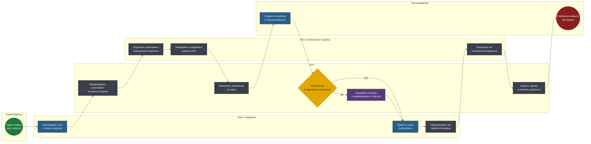

# BPMN 2.0 — ЭТП морских грузоперевозок

Две модели покрывают жизненный цикл сделки: заключение и исполнение.
Граница между ними — подписанный договор, точка, после которой стороны
уже не выбирают друг друга, а исполняют обязательства.

Исходники — в [diagrams/](diagrams/). Схемы генерируются из тех же моделей.

## Соглашения нотации

| Элемент | Как читать |
|---|---|
| Дорожка (lane) | Кто владеет шагом: грузовладелец, ЭТП, судовладелец, порт, внешние сервисы |
| Прямоугольник | Задача: синяя — ручная, серая — автоматическая, фиолетовая — отправка сообщения |
| Ромб | Исключающий шлюз |
| Зелёный / красный круг | Стартовое и конечное события |

---

## 1. Двухэтапные торги

Модель, отличающая отраслевую площадку от обычного маркетплейса: сначала
допуск, потом цена.

**Файл:** [`diagrams/01-two-stage-auction.bpmn`](diagrams/01-two-stage-auction.bpmn)

```mermaid
flowchart LR
    subgraph Lane_cargo["Грузовладелец"]
        direction LR
        Start_need(("Возникла потребность<br/>в перевозке"))
        T_lot["Сформировать лот:<br/>груз, маршрут, окно"]
        End_deal(("Сделка заключена"))
    end
    subgraph Lane_etp["ЭТП"]
        direction LR
        T_publish["Опубликовать лот<br/>и открыть предотбор"]
        T_verify["Проверить компанию,<br/>допуски и ледовый класс"]
        G_pass{"Предотбор пройден?"}
        T_admit["Допустить<br/>к финальным торгам"]
        T_refuse["Отклонить<br/>с указанием причины"]
        End_refused(("Участник не допущен"))
        G_enough{"Допущенных<br/>достаточно?"}
        T_auction["Запустить<br/>финальные торги"]
        T_fail["Признать торги<br/>несостоявшимися"]
        End_failed(("Торги<br/>не состоялись"))
        T_close["Закрыть торги по таймеру<br/>и определить победителя"]
        T_contract["Сформировать проект<br/>договора перевозки"]
        T_register["Зарегистрировать сделку<br/>и открыть отслеживание"]
    end
    subgraph Lane_ship["Судовладелец"]
        direction LR
        T_apply["Подать заявку<br/>на предотбор"]
        T_bid["Подавать<br/>ценовые предложения"]
    end
    subgraph Lane_ext["Внешние сервисы"]
        direction LR
        T_sign["Подписать документы<br/>электронной подписью"]
    end
    Start_need --> T_lot
    T_lot --> T_publish
    T_publish --> T_apply
    T_apply --> T_verify
    T_verify --> G_pass
    G_pass -- "да" --> T_admit
    G_pass -- "нет" --> T_refuse
    T_refuse --> End_refused
    T_admit --> G_enough
    G_enough -- "да" --> T_auction
    G_enough -- "нет" --> T_fail
    T_fail --> End_failed
    T_auction --> T_bid
    T_bid --> T_close
    T_close --> T_contract
    T_contract --> T_sign
    T_sign --> T_register
    T_register --> End_deal
    classDef evStart fill:#1f7a3f,stroke:#0f4523,color:#ffffff
    classDef evEnd fill:#8a1f1f,stroke:#4a0f0f,color:#ffffff
    classDef gw fill:#e0a800,stroke:#8a6800,color:#1a1a1a
    classDef userTask fill:#2b5d8a,stroke:#143349,color:#ffffff
    classDef svcTask fill:#3a3f4b,stroke:#1b1e24,color:#ffffff
    classDef msgTask fill:#5a3a7a,stroke:#2e1c40,color:#ffffff
    class Start_need evStart
    class T_lot,T_apply,T_bid userTask
    class T_publish,T_verify,T_admit,T_fail,T_auction,T_close,T_contract,T_sign,T_register svcTask
    class G_pass,G_enough gw
    class T_refuse msgTask
    class End_refused,End_failed,End_deal evEnd
```

<!-- diagram:01-two-stage-auction -->

<!-- /diagram -->

### Решения, зашитые в модель

**Предотбор идёт до торгов, а не параллельно с ними.** Если допускать всех
и проверять победителя, площадка регулярно будет отменять результаты: судно
без нужного ледового класса или компания без действующего допуска выиграет
по цене, а потом окажется непригодной. Второй заход на торги — потерянные
дни навигации. Проверка на входе стоит дешевле.

**Проверка компании — не формальность, а отдельный шаг с внешними
источниками.** Проверяются регистрационные данные, наличие судна в
регистре, ледовый класс, действующие допуски и страховое покрытие
ответственности. Каждый из этих пунктов способен превратить выигранный
лот в несостоявшуюся перевозку.

**Шлюз «Допущенных достаточно?» существует, потому что торги с одним
участником — не торги.** Площадка обязана явно признать процедуру
несостоявшейся, а не проводить формальный аукцион с единственным
предложением по стартовой цене. Ветка ведёт в отдельное конечное событие
и возвращает грузовладельца к пересмотру условий лота.

**Договор формирует площадка, подпись ставится вовне.** Проект договора и
сопутствующие документы собираются на ЭТП из шаблона и параметров лота;
криптографическая подпись выполняется внешним сервисом. Разделение важно:
площадка не хранит закрытые ключи участников и не может подписать за них.

**Отслеживание открывается сразу после регистрации сделки.** Не после
погрузки — с момента подписания. Грузовладельцу нужно видеть, что судно
идёт под погрузку, а не только что оно вышло с грузом.

---

## 2. Рейс и безбумажное закрытие сделки

Исполнение перевозки. Ключевая идея — статус берётся из объективного
источника, а не из отчётов сторон.

**Файл:** [`diagrams/02-voyage-tracking.bpmn`](diagrams/02-voyage-tracking.bpmn)

<!-- diagram:02-voyage-tracking -->

<!-- /diagram -->

### Решения, зашитые в модель

**Коносамент формируется по факту погрузки, а не по плану.** Документ
фиксирует то, что фактически принято на борт: количество, состояние,
дату. Формировать его заранее — значит подписать документ о грузе,
которого на судне может не оказаться в заявленном объёме.

**Данные AIS обновляют карту, но не подтверждают исполнение.** Координаты
отвечают на вопрос «где судно», а не «выполнены ли обязательства».
Приёмку груза фиксирует порт, акт подписывают стороны. Соблазн считать
приход в точку назначения автоматическим подтверждением доставки —
серьёзная ошибка: судно может прийти, но выгрузка не состоится.

**Шлюз отклонения от маршрута не останавливает рейс.** Отклонение —
частое явление в арктической навигации: обход ледового поля, ожидание
ледокольной проводки, смена порта из-за обстановки. Задача системы —
зафиксировать событие и уведомить стороны, а не заблокировать процесс.
Поэтому ветка «да» вливается обратно в основной поток, а не завершает его.

**Акт подписывается до закрытия сделки.** Порядок «подписать, потом
закрыть» гарантирует, что не возникнет закрытой сделки без подписанного
документа приёмки — иначе спор о недостаче будет нечем подтвердить.

**Закрытие обновляет рейтинги участников.** Площадка накапливает историю
исполнения: соблюдение сроков, инциденты, отклонения. Это единственный
механизм, который со временем делает предотбор осмысленнее формальной
проверки документов.

---

## Чего в моделях нет

- **Многоэтапные торги с переторжкой** — предусмотрены в полной версии
  продукта, но в модель не вынесены: это надстройка над двухэтапной
  схемой, а не отдельный процесс.
- **Претензионная работа** — спор о недостаче или порче груза выходит за
  границы площадки и регулируется договором и морским правом.
- **Слотирование в портах** — администрация порта управляет слотами в
  своей системе; ЭТП только отображает подтверждённый слот.
- **Финансовые расчёты** — эквайринг и банковские гарантии не входили в
  скоуп; площадка фиксирует условия оплаты, но не проводит платежи.
