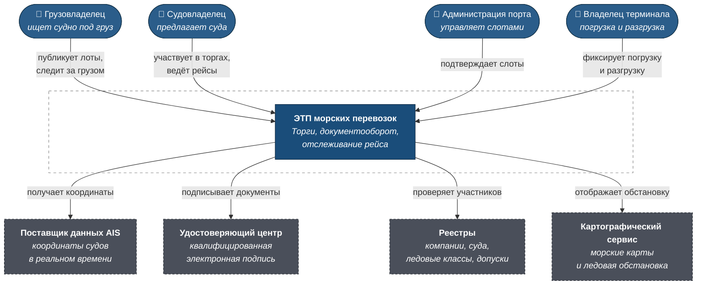
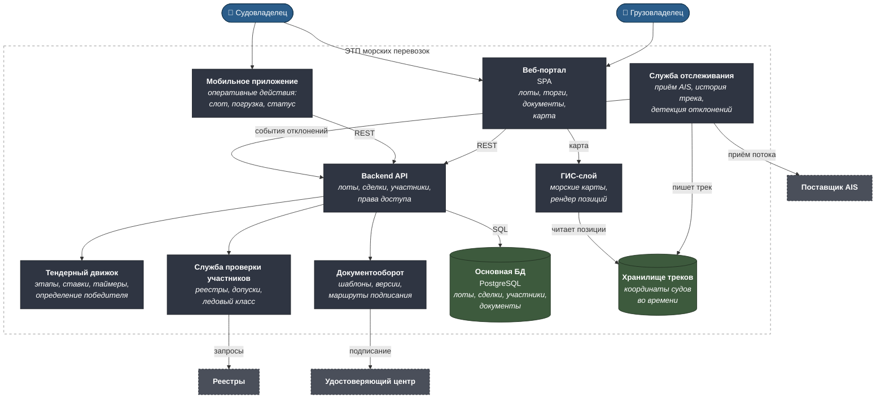
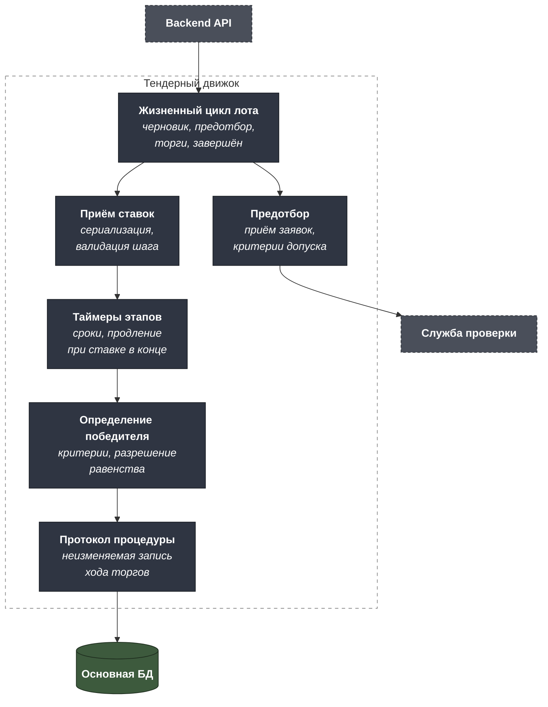
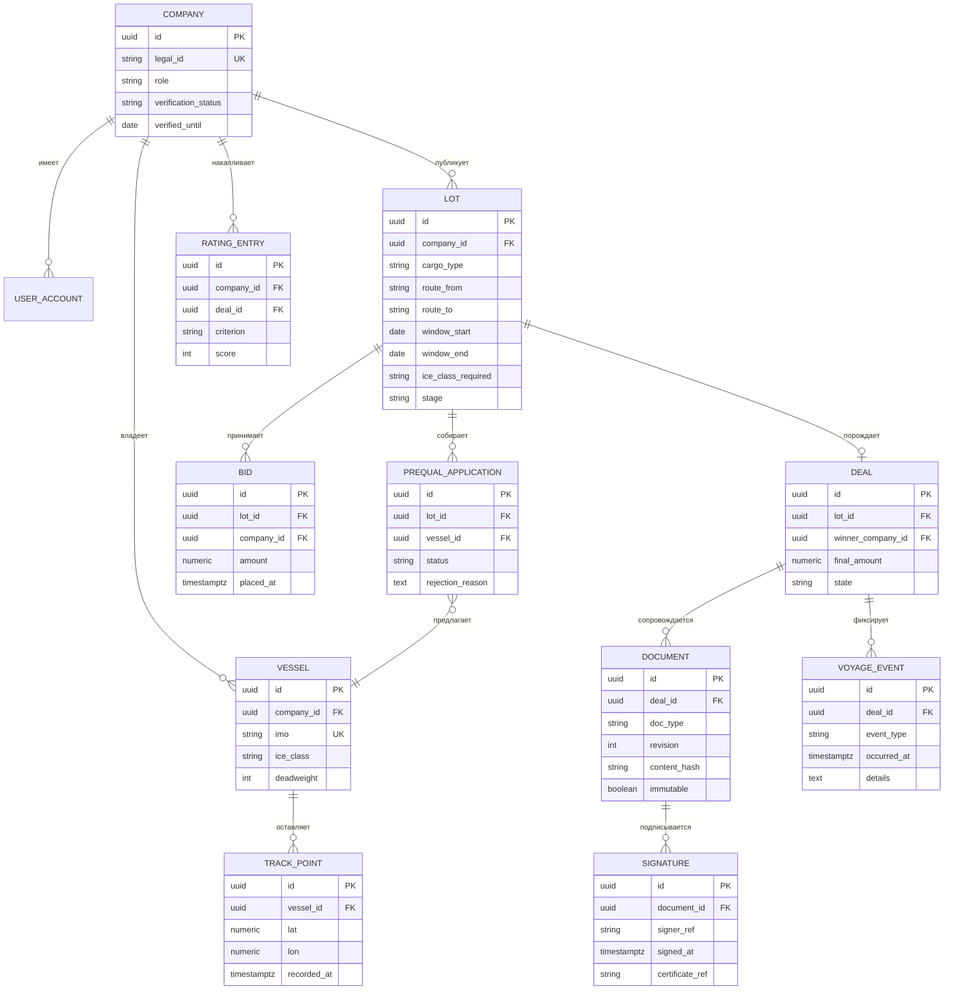

# C4 — ЭТП морских грузоперевозок

Машиночитаемый исходник — [`c4/workspace.dsl`](c4/workspace.dsl).

---

## Уровень 1. Контекст



### Границы

**В скоупе:** публикация лотов, двухэтапные торги, проверка участников,
формирование и подписание документов, отслеживание рейса, закрытие сделки,
рейтинги участников.

**Вне скоупа:** платежи и банковские гарантии, претензионная работа,
таможенное оформление, управление слотами внутри порта (площадка
отображает подтверждённый слот, но не распределяет их).

---

## Уровень 2. Контейнеры



### Почему так

**Тендерный движок вынесен из основного API.** Торги — это работа с
таймерами и конкурентными ставками: несколько участников жмут «подать
предложение» в последние секунды, и порядок обработки определяет
победителя. Такая логика требует строгой сериализации операций и своих
гарантий, отличных от остального CRUD. Смешивать её с обычными запросами —
значит либо тормозить всё, либо получить спорный результат торгов.

**Треки судов лежат отдельно от реляционной базы.** Координаты приходят
непрерывно по всем судам в рейсе: это поток временных рядов с большим
объёмом записи и запросами вида «покажи путь за последние сутки».
Профиль нагрузки принципиально другой, чем у сделок и документов.

**Документооборот — отдельный контейнер с маршрутами подписания.**
Коносамент подписывают несколько сторон в определённом порядке; документ
имеет версии, а подписанная версия неизменяема. Это самостоятельная
предметная область со своей моделью состояний.

**Мобильное приложение решает узкий набор задач.** Портовая администрация
и капитан не работают с торгами со смартфона — им нужно подтвердить слот,
зафиксировать начало погрузки, посмотреть статус. Попытка перенести
веб-функциональность целиком в мобильное приложение удвоила бы стоимость
без пользы.

---

## Уровень 3. Компоненты тендерного движка



**Продление таймера при ставке в последние минуты — не украшение.** Без
него торги превращаются в состязание в скорости клика на последней
секунде, а результат зависит от задержки сети участника. Правило «ставка в
последние N минут продлевает этап» — отраслевой стандарт, снимающий этот
класс споров.

**Протокол процедуры неизменяем.** Ход торгов — юридически значимая
запись: кто, когда и какую ставку подал. Оспаривание результата начинается
с запроса протокола, и он должен быть защищён от правки задним числом.

---

## Модель данных



**`DOCUMENT.content_hash` и `immutable` — основа юридической значимости.**
Подписанная версия документа фиксируется хешом и помечается неизменяемой.
Правка создаёт новую ревизию, требующую нового подписания. Без этого
электронный коносамент не имеет силы: подпись должна относиться к
конкретному содержанию.

**`COMPANY.verified_until` — срок годности проверки.** Допуски и
страховое покрытие имеют срок действия. Компания, прошедшая предотбор
полгода назад, могла с тех пор потерять допуск. Дата принудительно
устаревает проверку и требует повторной перед новым лотом.

**`VOYAGE_EVENT` отделён от `TRACK_POINT`.** Координата — сырые данные,
событие — интерпретация: «отклонение от маршрута», «задержка более 12
часов», «смена порта назначения». Событий на порядки меньше, они попадают
в уведомления и в рейтинг, а треки нужны только для карты и разбора.

---

## Матрица ролей и прав

| Действие | Грузовладелец | Судовладелец | Администрация порта | Терминал |
|---|---|---|---|---|
| Создать лот | ✅ | — | — | — |
| Видеть чужие лоты | только свои | все открытые | по своему порту | по своему терминалу |
| Подать заявку на предотбор | — | ✅ | — | — |
| Видеть состав участников предотбора | ✅ после закрытия этапа | только свою заявку | — | — |
| Подать ставку | — | ✅ если допущен | — | — |
| Видеть ставки конкурентов | ✅ | только лучшую цену | — | — |
| Подтвердить слот | — | — | ✅ | — |
| Зафиксировать погрузку | — | ✅ | — | ✅ |
| Подписать коносамент | ✅ | ✅ | — | — |
| Видеть трек судна | ✅ по своей сделке | ✅ по своим судам | ✅ по подходу к порту | — |
| Закрыть сделку | ✅ | ✅ | — | — |

**Судовладелец не видит ставки конкурентов по сумме — только лучшую
цену.** Это осознанное ограничение: раскрытие полной картины позволяет
вычислять стратегию конкурента по серии торгов. Грузовладелец видит всё —
он организатор процедуры и несёт ответственность за её результат.

---

## Как открыть DSL

```bash
docker run -it --rm -p 8080:8080 \
  -v "$PWD/projects/06-maritime-etp/c4:/usr/local/structurizr" \
  structurizr/lite
```
