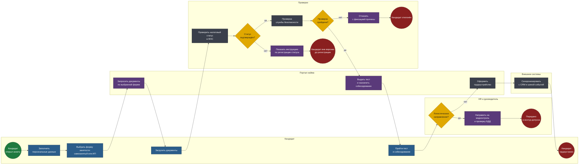
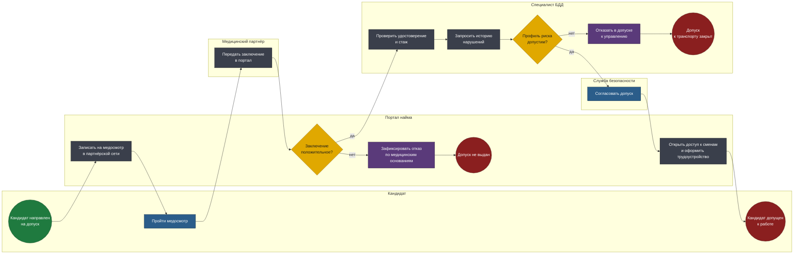

# BPMN 2.0 — HR-платформа массового найма

Две модели. Первая — общая воронка кандидата, одинаковая для обеих
дочерних компаний. Вторая — дополнительный контур допуска, работающий
только для логистического направления.

Исходники — в [diagrams/](diagrams/). Схемы генерируются из тех же моделей.

## Соглашения нотации

| Элемент | Как читать |
|---|---|
| Дорожка (lane) | Кто владеет шагом: кандидат, портал, службы проверки, HR, внешние системы |
| Прямоугольник | Задача: синяя — ручная, серая — автоматическая, фиолетовая — отправка сообщения |
| Ромб | Исключающий шлюз |
| Зелёный / красный круг | Стартовое и конечное события |

---

## 1. Путь кандидата от анкеты до трудоустройства

Основная воронка. Разветвление на две дочерние компании происходит в
конце, а не в начале — и это ключевое решение модели.

**Файл:** [`diagrams/01-candidate-journey.bpmn`](diagrams/01-candidate-journey.bpmn)

<!-- diagram:01-candidate-journey -->

<!-- /diagram -->

### Решения, зашитые в модель

**Форма занятости выбирается до запроса документов.** Самозанятый и
индивидуальный предприниматель предъявляют разные комплекты. Спрашивать
всё сразу «на всякий случай» — значит требовать от половины кандидатов
документы, которые им не нужны, и терять их на этом шаге. Массовый найм
чувствителен к каждому лишнему полю.

**Проверка налогового статуса ведёт к инструкции, а не к отказу.** Человек,
который ещё не зарегистрировался как самозанятый, — не отбракованный
кандидат, а кандидат, которому нужно пять минут в приложении налоговой.
Ветка «нет» показывает инструкцию и оставляет заявку в состоянии
ожидания. Отказ здесь означал бы терять людей, которые готовы работать.

**Проверка службы безопасности идёт до теста, а не после.** Порядок
определяется стоимостью: автоматическая проверка дешевле, чем время
рекрутера на собеседование. Отсеивать нужно раньше самого дорогого шага,
а не позже.

**Разветвление на дочерние компании — в конце воронки.** Первые шесть
шагов одинаковы для сборщика заказов и для водителя. Развести процессы с
самого начала означало бы поддерживать две почти идентичные воронки и
дублировать каждое изменение. Шлюз стоит там, где пути действительно
расходятся.

**Синхронизация с внешними системами — последний шаг, а не сквозной.**
Кандидат считается трудоустроенным по решению платформы; выгрузка в CRM
и на событийную шину происходит после. Недоступность внешней системы не
должна останавливать найм — обоснование в [adr-event-bus.md](adr-event-bus.md).

---

## 2. Медконтроль и проверка безопасности движения

Контур допуска для логистического направления. Запускается после общей
воронки и до открытия доступа к сменам.

**Файл:** [`diagrams/02-driver-clearance.bpmn`](diagrams/02-driver-clearance.bpmn)

<!-- diagram:02-driver-clearance -->

<!-- /diagram -->

### Решения, зашитые в модель

**Медицинский контроль идёт до проверки водительского профиля.** Порядок
не произвольный: медицинское противопоказание отсекает кандидата
безусловно, а история нарушений допускает оценку. Дешёвый безусловный
фильтр ставится перед дорогим оценочным.

**Проверка безопасности движения — не бинарный запрет, а профиль риска.**
Одно нарушение правил парковки трёхлетней давности и систематическое
превышение скорости — разные вещи. Шлюз оценивает профиль целиком, а не
наличие записей в истории.

**Согласование допуска остаётся за человеком.** Финальный шаг —
подтверждение службой безопасности. Автоматическое открытие доступа к
управлению транспортом при пограничном профиле — риск, который нельзя
переложить на алгоритм: последствия ошибки здесь измеряются не деньгами.

**Доступ к сменам открывается вместе с оформлением, а не до него.** Иначе
возникает состояние, в котором человек уже может выйти на смену, но
формально не трудоустроен. Оба действия — один шаг.

**Отказ фиксируется с причиной, а не просто закрывает заявку.** У
кандидата есть право понимать основание, а у компании — обязанность его
хранить: медицинский отказ и отказ по профилю нарушений имеют разные
последствия и разные сроки, после которых можно подать заявку повторно.

---

## Чего в моделях нет

- **Наставничество и адаптация после найма** — отдельный процесс за
  границей воронки.
- **Расторжение и повторный найм** — важный сценарий для массового
  персонала, но он относится к жизненному циклу сотрудника, а не кандидата.
- **Планирование смен** — выполняется в операционной системе, платформа
  только открывает доступ.
