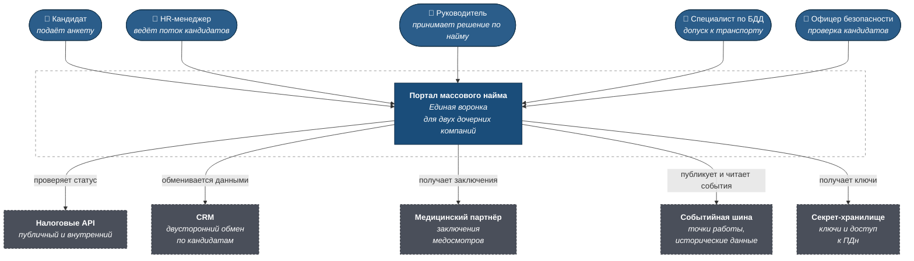
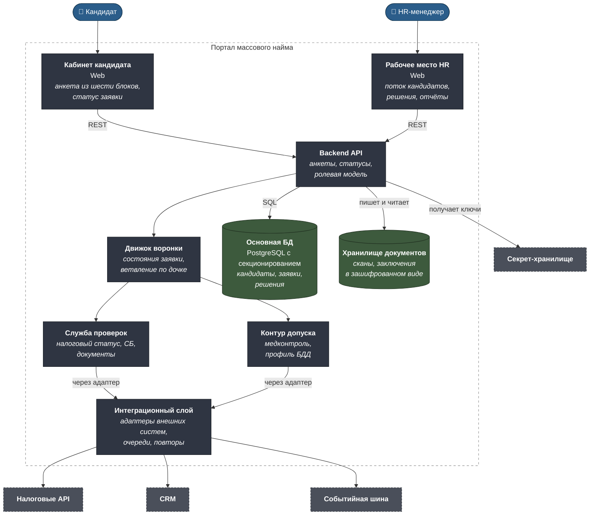
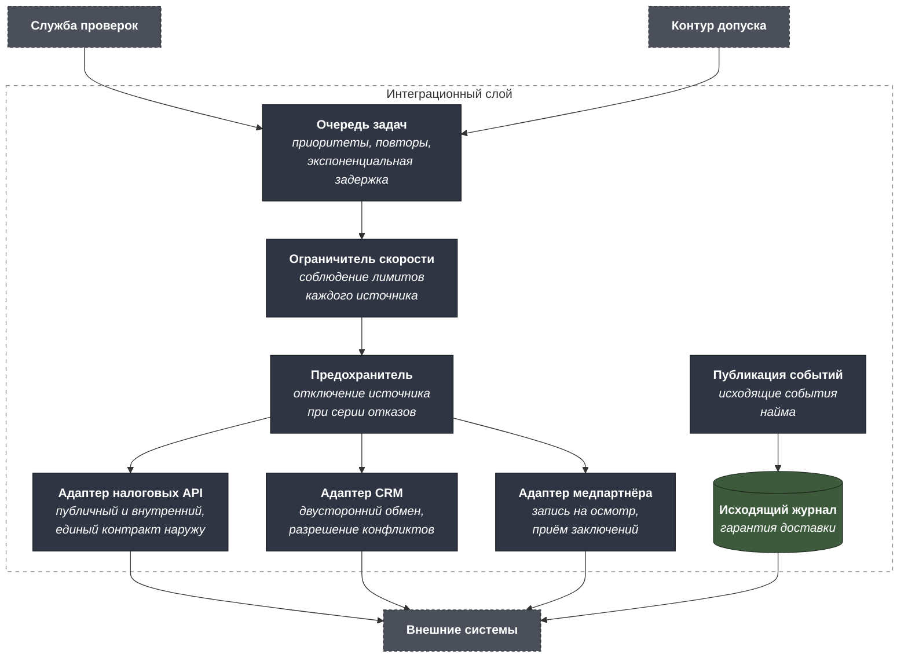
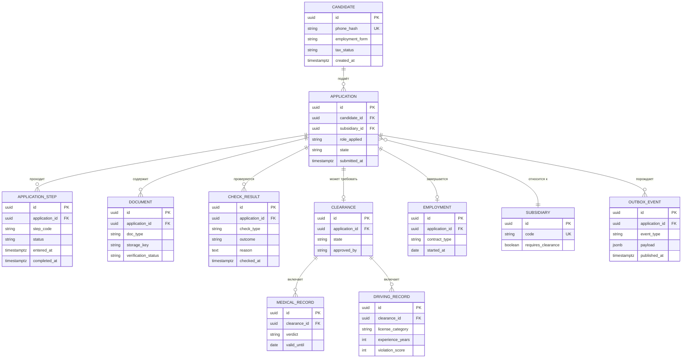

# C4 — HR-платформа массового найма

Машиночитаемый исходник — [`c4/workspace.dsl`](c4/workspace.dsl).

---

## Уровень 1. Контекст



### Границы

**В скоупе:** анкета кандидата, выбор формы занятости, верификация
документов, налоговая проверка, проверка безопасности, тестирование,
медконтроль и допуск к транспорту, оформление, ролевая модель.

**Вне скоупа:** планирование и распределение смен, расчёт вознаграждения,
адаптация и наставничество после найма, расторжение отношений.

---

## Уровень 2. Контейнеры



### Почему так

**Интеграционный слой — отдельный контейнер, а не библиотека в каждом
сервисе.** Шесть внешних систем с разными протоколами, разными лимитами и
разной надёжностью. Публичный налоговый API допускает два вызова в минуту;
внутренний не имеет документации и может изменить формат ответа без
предупреждения. Адаптеры собраны в одном месте, чтобы изменение контракта
внешней системы правилось в одной точке, а не искалось по всей кодовой базе.

**Движок воронки хранит состояние заявки явно.** Кандидат проходит
восемь шагов, часть из них асинхронна — налоговая проверка может занять
часы из-за лимита вызовов. Состояние заявки должно переживать перезапуск
сервиса и позволять возобновление с любого шага, а не начинаться заново.

**Контур допуска отделён от общих проверок.** Он работает только для
логистического направления, обращается к медицинскому партнёру и оперирует
данными о здоровье. Отдельный контейнер даёт отдельное разграничение
доступа: HR-менеджер сборщиков заказов не должен иметь технической
возможности увидеть медицинские заключения водителей.

**Документы лежат отдельно от основной базы в зашифрованном виде.** Сканы
паспортов и медицинские заключения — самые чувствительные данные системы.
Ключи шифрования получаются из секрет-хранилища, а не хранятся в
конфигурации приложения.

**Секционирование таблиц по времени, а не по дочерней компании.** Основной
профиль запросов — работа с текущим потоком кандидатов; заявки прошлых
периодов читаются только в отчётах. Секционирование по дате подачи
оставляет горячие данные компактными.

---

## Уровень 3. Компоненты интеграционного слоя



**Исходящий журнал решает проблему двух записей.** Сохранить кандидата в
базу и опубликовать событие о найме — две операции в двух системах.
Если между ними произойдёт сбой, кандидат окажется трудоустроен в
платформе и не существующим для остальной экосистемы. Событие пишется в
исходящий журнал в той же транзакции, что и изменение данных, а
публикуется отдельным процессом.

**Предохранитель нужен именно из-за недокументированного API.** Когда
внешний источник начинает отвечать ошибками, продолжать долбить его
запросами — способ получить блокировку и потерять доступ надолго. После
серии отказов источник временно отключается, зависящие от него проверки
уходят в отложенное состояние, HR видит это явно.

---

## Модель данных



**`SUBSIDIARY.requires_clearance` — конфигурация, а не код.** Различие
между двумя дочерними компаниями сводится к флагу и набору обязательных
шагов. Именно это позволяет держать один продукт с двумя инстансами, а не
две расходящиеся версии. Появится третья компания — добавится строка, а не
ветка в коде.

**`APPLICATION_STEP` хранит время входа и выхода из каждого шага.** Это
даёт воронку не как счётчик статусов, а как измеримый процесс: где
кандидаты застревают, сколько ждут налоговой проверки, на каком шаге
отваливаются. Для массового найма аналитика воронки — основной инструмент
управления.

**`CHECK_RESULT.reason` обязателен при отрицательном исходе.** Кандидат
имеет право знать причину отказа, а компания обязана её хранить.
Отдельное поле вместо свободного комментария в заявке позволяет считать
статистику по причинам и находить сломанные проверки.

**`MEDICAL_RECORD.valid_until`.** Медицинское заключение имеет срок
действия; истёкшее не даёт допуска. Без этого поля система однажды выпустит
на линию водителя с просроченным осмотром.

---

## Ролевая модель

| Действие | Кандидат | HR | Руководитель | Специалист БДД | Офицер СБ | Наставник |
|---|---|---|---|---|---|---|
| Заполнять анкету | ✅ | — | — | — | — | — |
| Видеть свой статус | ✅ | — | — | — | — | — |
| Видеть поток кандидатов | — | ✅ | ✅ своего подразделения | — | — | — |
| Видеть документы кандидата | — | ✅ | — | — | ✅ | — |
| Видеть медицинское заключение | своё | — | — | ✅ | — | — |
| Проводить проверку СБ | — | — | — | — | ✅ | — |
| Оценивать профиль БДД | — | — | — | ✅ | — | — |
| Согласовывать допуск | — | — | — | — | ✅ | — |
| Принимать решение о найме | — | ✅ | ✅ | — | — | — |
| Вести адаптацию | — | — | — | — | — | ✅ |
| Выгружать отчёты | — | ✅ | ✅ | — | — | — |

**HR не видит медицинских заключений.** Это не формальность: данные о
здоровье относятся к специальной категории персональных данных, и доступ
к ним ограничен теми, кому они нужны для решения — специалистом по БДД.
HR видит результат допуска, а не его медицинское основание.

**Наставник не видит документов и проверок.** Ему нужен человек, вышедший
на работу, а не история его найма.

---

## Расчёт ёмкости

Отправная точка: 80 000 пользователей, 100 запросов в секунду в пике.

| Что считаем | Логика | Следствие |
|---|---|---|
| Профиль нагрузки | Пик приходится на утро буднего дня, когда кандидаты заполняют анкеты | Масштабирование по расписанию дешевле постоянного резерва |
| Доля записи | Заполнение анкеты — операции записи; просмотр статуса — чтения | Реплики для чтения снимают основную часть нагрузки |
| Налоговые проверки | Публичный API — 2 вызова в минуту, поток кандидатов кратно больше | Проверка асинхронна очередями, кандидат не ждёт ответа на экране |
| Рост таблицы заявок | Тысячи заявок в месяц, история хранится годами | Секционирование по дате подачи |
| Документы | Сканы паспортов и заключений — гигабайты | Объектное хранилище, а не база |

Ключевой вывод расчёта: **синхронное ожидание внешних проверок
несовместимо с целевой нагрузкой.** Лимит в два вызова в минуту делает
невозможной модель «кандидат ждёт результата на экране». Это ограничение
породило асинхронную воронку — и именно оно стоит за архитектурным
решением в [adr-event-bus.md](adr-event-bus.md).

---

## Как открыть DSL

```bash
docker run -it --rm -p 8080:8080 \
  -v "$PWD/projects/07-mass-hiring-platform/c4:/usr/local/structurizr" \
  structurizr/lite
```
