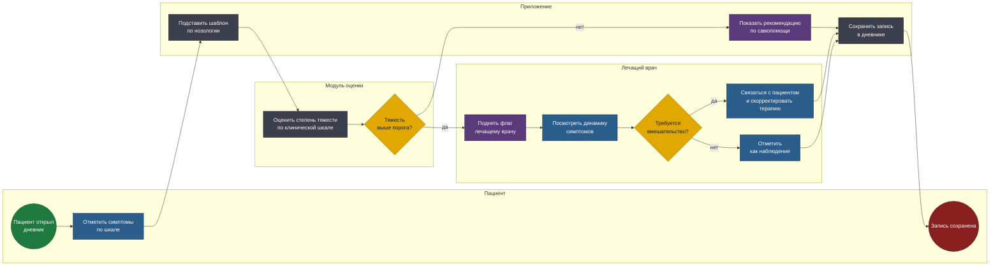
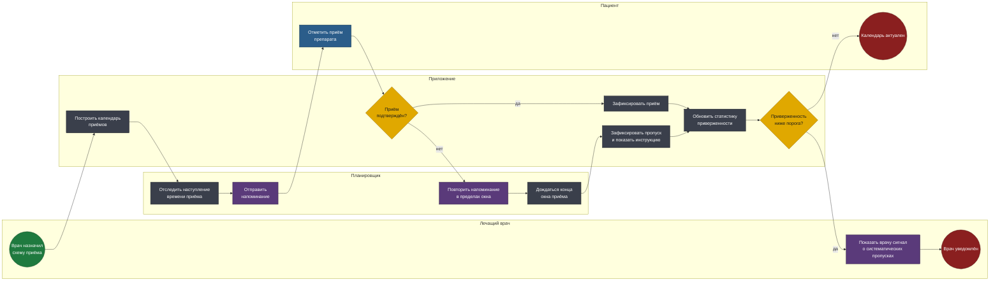

# BPMN 2.0 — Трекер симптомов для онкопациентов

Два процесса ядра MVP. Оба спроектированы с учётом регуляторной границы:
система показывает и передаёт информацию, но не ставит диагнозов и не
назначает лечение — обоснование в [discovery.md](discovery.md).

Исходники — в [diagrams/](diagrams/). Схемы генерируются из тех же моделей.

## Соглашения нотации

| Элемент | Как читать |
|---|---|
| Дорожка (lane) | Кто владеет шагом: пациент, приложение, модуль оценки, врач |
| Прямоугольник | Задача: синяя — ручная, серая — автоматическая, фиолетовая — отправка сообщения |
| Ромб | Исключающий шлюз |
| Зелёный / красный круг | Стартовое и конечное события |

---

## 1. Ежедневный учёт симптомов и эскалация

Основной сценарий использования: пациент отмечает состояние, система
решает, достаточно ли справочной информации или стоит поднять флаг врачу.

**Файл:** [`diagrams/01-symptom-tracking.bpmn`](diagrams/01-symptom-tracking.bpmn)

<!-- diagram:01-symptom-tracking -->

<!-- /diagram -->

### Решения, зашитые в модель

**Шаблон подставляется по нозологии, а не общий на всех.** У пациента на
химиотерапии и у пациента после операции разные ожидаемые симптомы и
разные тревожные признаки. Универсальный список из тридцати пунктов не
заполнит никто: человек в терапии тратит на дневник минуту в день, а не
десять.

**Оценка тяжести идёт по принятой клинической шкале, а не по
самодельной.** Врач должен видеть данные в терминах, которыми пользуется
в работе. Собственная шкала «от 1 до 5» превращает дневник в набор
субъективных чисел, непригодных ни для решения, ни для исследования.

**Модуль оценки поднимает флаг, а не ставит диагноз.** Это регуляторная
граница, проведённая прямо в модели: система сообщает врачу «показатель
выше порога», а решение о вмешательстве принимает врач в своей дорожке.
Если бы шлюз вёл к автоматической рекомендации по лечению, приложение
стало бы медицинским изделием со всеми последствиями по срокам и
стоимости.

**Ветка «ниже порога» не пустая.** Пациент получает справочную информацию
по самопомощи, а не молчание. Дневник, который ничего не отвечает, быстро
перестают вести — а без регулярности он бесполезен и клинически, и как
источник данных.

**Запись сохраняется в обеих ветках.** Данные о лёгких симптомах не менее
ценны: динамика важнее отдельного пика, а для B2B-модели важен полный ряд,
а не только тревожные точки.

---

## 2. Календарь приёма препаратов

Второй компонент MVP. Задача — не напоминать, а фиксировать
приверженность терапии: пропуски приёмов клинически значимы.

**Файл:** [`diagrams/02-medication-schedule.bpmn`](diagrams/02-medication-schedule.bpmn)

<!-- diagram:02-medication-schedule -->

<!-- /diagram -->

### Решения, зашитые в модель

**Повторное напоминание ограничено окном приёма, а не повторяется
бесконечно.** У препаратов есть терапевтическое окно: принять дозу с
опозданием на два часа — нормально, на восемь — уже другое решение,
которое принимает врач. Модель отражает это: после окончания окна пропуск
фиксируется, а не догоняется напоминаниями.

**Пропуск фиксируется вместе с инструкцией, а не как упрёк.** Пациенту
показывается справочная информация о том, что делать при пропуске дозы, —
без указаний «примите двойную дозу», это была бы уже рекомендация по
лечению.

**Приверженность считается накопительно, а не по одному пропуску.** Один
пропущенный приём — жизнь. Систематические пропуски — клинический факт,
влияющий на эффективность терапии, и о нём врач должен знать. Шлюз
срабатывает на пороге, а не на событии.

**Врач получает сигнал, а не отчёт.** Онколог ведёт десятки пациентов и
не будет читать статистику каждого. Уведомление приходит только тогда,
когда есть повод: приверженность упала ниже порога.

---

## Что за границами MVP

- **Телемедицина** — сознательно не входит в MVP: она требует отдельного
  регуляторного контура и меняет продукт с дневника на медицинскую услугу.
- **Интеграция с медицинскими информационными системами** — зависит от
  того, кто станет первым B2B-плательщиком; до этого решения
  проектировать интеграцию преждевременно.
- **Обезличенная выгрузка данных для фармы** — основа будущей монетизации,
  но требует юридического контура согласий, которого на стадии discovery
  ещё не было.
