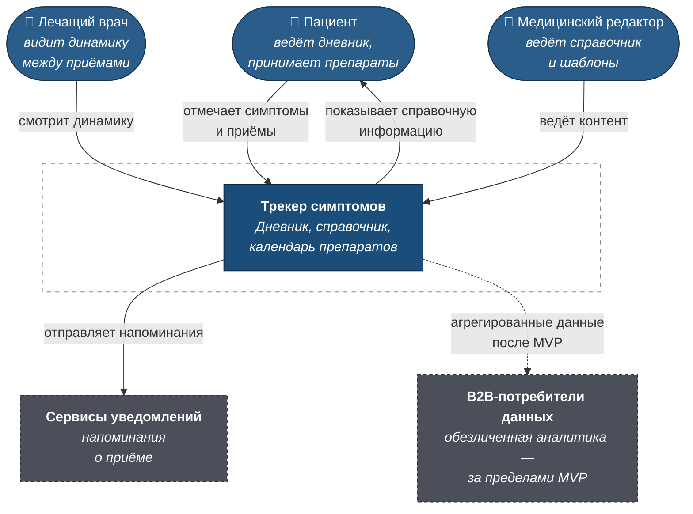
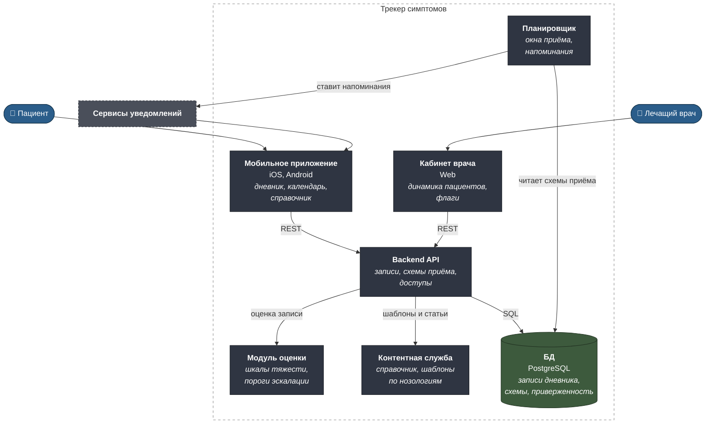
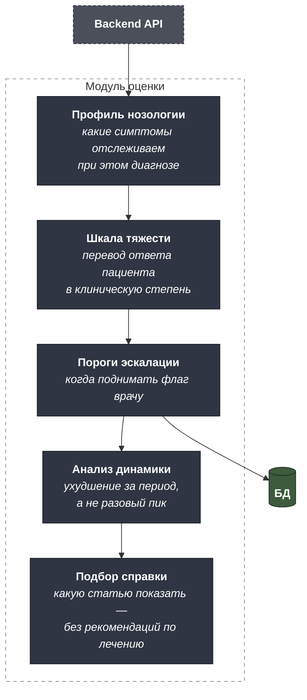

# C4 — Трекер симптомов для онкопациентов

Машиночитаемый исходник — [`c4/workspace.dsl`](c4/workspace.dsl).

Архитектура MVP спроектирована с одним сквозным ограничением: система не
интерпретирует данные пациента в клиническом смысле. Это не техническое
требование, а условие, при котором продукт не становится медицинским
изделием — см. [discovery.md](discovery.md).

---

## Уровень 1. Контекст



### Границы MVP

**В скоупе:** дневник симптомов с шаблонами по нозологиям, справочник в
информационно-просветительском формате, календарь приёма препаратов с
напоминаниями, доступ врача к динамике пациента.

**Вне скоупа:** телемедицина и консультации, интерпретация данных с
клиническими рекомендациями пациенту, интеграция с медицинскими
информационными системами, обезличенная выгрузка для B2B.

Последний пункт — не «забыли», а осознанная последовательность: пока не
определён первый B2B-плательщик, требования к выгрузке неизвестны, а
проектировать их наугад дороже, чем добавить позже.

---

## Уровень 2. Контейнеры



### Почему так

**Модуль оценки вынесен отдельно от API.** Это место, где проходит
регуляторная граница. Логика «какой симптом при какой нозологии считается
тревожным» должна быть сосредоточена в одном компоненте, который можно
предъявить юристу и медицинскому эксперту целиком, а не искать по коду.
Когда встанет вопрос «интерпретирует ли ваше приложение клинические
данные», ответ должен быть проверяемым.

**Контентная служба отделена от кода.** Справочник и шаблоны симптомов
ведёт медицинский редактор, а не разработчик. Обновление формулировки в
справочнике не должно требовать релиза приложения — в информационно-
просветительском формате именно формулировки определяют регуляторный
статус, и править их нужно быстро.

**Планировщик читает схемы напрямую, минуя API.** Он работает по всем
пациентам массово в фоне; проходить через прикладной API ради этого —
лишний слой без пользы.

**Кабинет врача — отдельный контейнер, а не роль в приложении пациента.**
У врача принципиально другой сценарий: он смотрит не одного пациента, а
список с флагами, и делает это с компьютера.

---

## Уровень 3. Компоненты модуля оценки



**Анализ динамики важнее порога по одному значению.** Тошнота второй
степени однократно — ожидаемый побочный эффект. Та же тошнота третий день
подряд с нарастанием — повод для врача. Флаг по разовому значению
завалил бы врача ложными срабатываниями, и он перестал бы их читать.

**Подбор справки не даёт рекомендаций по лечению.** Компонент выбирает,
какую статью справочника показать, — и это осознанно самая «глупая» часть
системы. Любая логика вида «при таком симптоме сделайте то-то» переводит
приложение в другой регуляторный статус.

---

## Модель данных

```mermaid
erDiagram
    PATIENT ||--o{ SYMPTOM_ENTRY : "ведёт"
    PATIENT ||--|| NOZOLOGY_PROFILE : "имеет"
    NOZOLOGY_PROFILE ||--o{ SYMPTOM_TEMPLATE : "определяет"
    SYMPTOM_ENTRY }o--|| SYMPTOM_TEMPLATE : "заполняется по"
    SYMPTOM_ENTRY ||--o| ESCALATION : "может вызвать"
    PATIENT ||--o{ MEDICATION_PLAN : "получает"
    MEDICATION_PLAN ||--o{ INTAKE_EVENT : "порождает"
    PATIENT }o--o{ DOCTOR : "наблюдается у"
    SYMPTOM_TEMPLATE }o--|| ARTICLE : "связан со справкой"

    PATIENT {
        uuid id PK
        string external_ref
        date diagnosis_date
        string consent_status
    }
    NOZOLOGY_PROFILE {
        uuid id PK
        string nozology_code
        string therapy_line
    }
    SYMPTOM_TEMPLATE {
        uuid id PK
        uuid profile_id FK
        string symptom_code
        string scale_type
        int escalation_threshold
    }
    SYMPTOM_ENTRY {
        uuid id PK
        uuid patient_id FK
        uuid template_id FK
        int reported_value
        int graded_severity
        timestamptz recorded_at
    }
    ESCALATION {
        uuid id PK
        uuid entry_id FK
        string reason
        string doctor_action
        timestamptz raised_at
    }
    MEDICATION_PLAN {
        uuid id PK
        uuid patient_id FK
        string drug_ref
        string schedule_rule
        int window_minutes
        date valid_until
    }
    INTAKE_EVENT {
        uuid id PK
        uuid plan_id FK
        timestamptz due_at
        timestamptz confirmed_at
        string status
    }
    DOCTOR {
        uuid id PK
        string speciality
    }
    ARTICLE {
        uuid id PK
        string title
        text body
        string content_version
    }
```



**`SYMPTOM_ENTRY` хранит и то, что отметил пациент, и рассчитанную
степень.** Пациент отвечает на понятный ему вопрос, система переводит
ответ в клиническую шкалу. Хранить только результат перевода — значит
потерять исходные данные при изменении шкалы и лишиться возможности
пересчитать историю.

**`MEDICATION_PLAN.window_minutes` — терапевтическое окно приёма.** Именно
оно определяет, до какого момента напоминание имеет смысл, а после какого
приём считается пропущенным. Значение задаётся схемой терапии, а не общей
настройкой приложения.

**`ARTICLE.content_version`.** Справочник меняется, а показанная пациенту
версия должна быть восстановима: в регулируемой области важно, что именно
человек прочитал в тот день.

**`PATIENT.consent_status` заложен в MVP, хотя выгрузки ещё нет.**
Собирать согласия задним числом у пациентов, часть из которых уже
завершила лечение, невозможно. Поле дешевле добавить сразу, чем потерять
всю накопленную базу для будущей B2B-модели.

---

## Как открыть DSL

```bash
docker run -it --rm -p 8080:8080 \
  -v "$PWD/projects/08-oncology-symptom-tracker/c4:/usr/local/structurizr" \
  structurizr/lite
```
