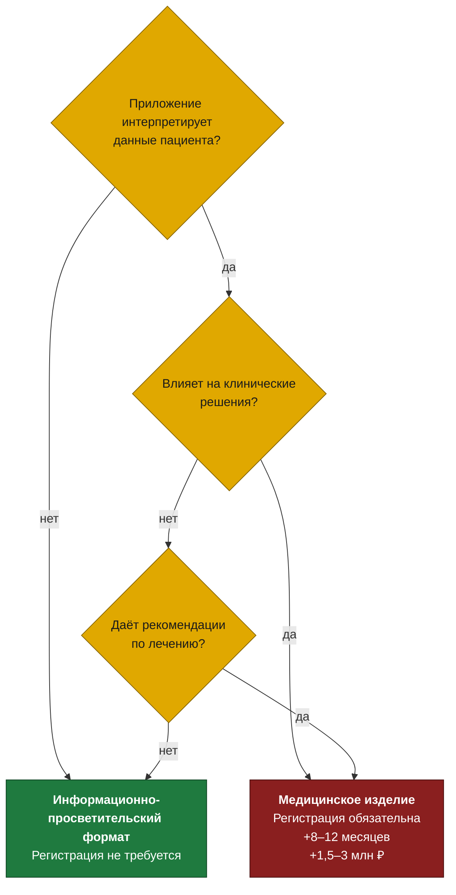

# Discovery: рынок, регуляторика, экономика

Итог первичного исследования. Цель — не описать приложение, а ответить,
есть ли здесь продукт, и какие решения нужно принять до фиксации
архитектуры.

---

## 1. Размер рынка

| Показатель | Значение | Источник оценки |
|---|---|---|
| Пациентов на онкологическом учёте в РФ | 4,4 млн (более 3% населения) | Официальная статистика |
| Новых случаев в год | около 700 тысяч | Официальная статистика |
| Пациентов на активной терапии одновременно | доля от общего учёта | Расчётная оценка |

**Что здесь важно понимать.** Четыре миллиона на учёте — не адресуемый
рынок. Значительная часть — пациенты в ремиссии и на длительном
наблюдении, которым ежедневный трекинг симптомов не нужен. Реальная
аудитория продукта — те, кто проходит активное лечение прямо сейчас, и
это кратно меньшая цифра.

Подменять адресуемый рынок цифрой общего учёта — стандартный приём
презентаций для инвестора и стандартная причина, по которой финансовая
модель потом не сходится. В расчёте использована узкая оценка.

---

## 2. Доказательная база

Единственное, что отличает этот продукт от «ещё одного дневника
самочувствия»: клиническая польза подтверждена рандомизированными
исследованиями.

- Регулярный сбор симптомов, о которых сообщает сам пациент, **продлевает
  жизнь в среднем на 5 месяцев**
- **Снижает обращения в скорую помощь на 6%**

Механизм понятен: осложнение, замеченное на ранней стадии, лечится
амбулаторной коррекцией, а замеченное поздно — госпитализацией и
прерыванием курса терапии.

**Почему это основа бизнес-модели, а не просто аргумент.** Продлённая
жизнь и сокращение экстренных госпитализаций — измеримая ценность для
тех, кто платит за лечение: страховых компаний и клиник. Для фармы —
это данные о переносимости препарата в реальной практике, которые она не
получает из клинических исследований. Именно доказательная база
превращает пациентское приложение в B2B-продукт.

---

## 3. Конкурентная карта

| Сегмент | Что есть | Слабое место |
|---|---|---|
| Российские приложения | Есть решение в схожей нише | Функционально недоработано, устойчивая модель монетизации не просматривается |
| Глобальные лидеры | Зрелые продукты с B2B-моделями | На российском рынке недоступны |
| Общие трекеры здоровья | Множество приложений | Не заточены под онкологию: нет шаблонов по нозологиям, нет шкал оценки токсичности |
| Сервисы клиник | Личные кабинеты медучреждений | Привязаны к одной клинике, пациент ведёт лечение в нескольких |

**Вывод.** Ниша не занята, но и не пуста: наличие недоработанного
конкурента означает, что гипотезу уже кто-то проверял и не довёл. Это
повод разобраться, почему именно не довёл, а не аргумент «конкурентов
нет».

**Что глобальные лидеры делают правильно.** Все зрелые продукты в этой
нише зарабатывают на B2B, а не на подписке пациента. Пациент в активной
терапии — не та аудитория, с которой можно строить экономику на платной
подписке: у него другие приоритеты и другие расходы.

---

## 4. Регуляторный контур

Ключевая развилка проекта, определяющая срок и стоимость.

**Что это значит на практике.** Разница между «показать пациенту его
динамику» и «сказать пациенту, что делать» — это разница между запуском
через четыре месяца и запуском через полтора года с дополнительными
затратами в несколько миллионов.

Формулировки в интерфейсе становятся регуляторным вопросом, а не
редакторским. «У вас тошнота третьей степени, обратитесь к врачу» — это
интерпретация. «Вы отметили тошноту. Вот справочная информация о том, как
шкалы оценивают тяжесть» — информирование.

**Рекомендация discovery:** MVP делается в информационно-просветительском
формате, а разговор с юристом ведётся **до** фиксации архитектуры, а не
после. Переделывать логику приложения под регуляторные требования на
поздней стадии дороже, чем спроектировать её сразу.

---

## 5. Модель монетизации

| Модель | Кто платит | Ценность для плательщика | Оценка |
|---|---|---|---|
| B2B: фарма | Фармкомпании | Данные о переносимости препарата в реальной практике | Основной путь |
| B2B: страховые | Страховые компании | Снижение экстренных госпитализаций — прямая экономия | Основной путь |
| B2B: клиники | Онкоцентры и клиники | Удержание пациента, качество наблюдения между приёмами | Основной путь |
| B2C: подписка | Пациент | Удобство ведения дневника | Вторичный, не основа экономики |

**Почему подписка пациента не работает как основа.** Человек в активной
онкологической терапии несёт значительные расходы на лечение. Подписка на
приложение конкурирует в его бюджете с препаратами. Это не значит, что
платить не будут совсем — это значит, что на этом нельзя построить
экономику продукта.

**Разворот, который меняет продукт.** Если платит фарма или страховая,
приложение должно уметь отдавать агрегированные обезличенные данные — а
это отдельная функциональность, отдельный юридический контур согласий и
отдельная работа с обезличиванием. В MVP её нет, но архитектура должна
её допускать.

---

## 6. Привлечение пользователей

**Магазины приложений не работают для этой аудитории.** Человек, которому
только что поставили диагноз, не идёт искать приложение в каталоге. Он
разговаривает с врачом.

Единственный работающий канал — через медицинское сообщество: врачи,
клиники, онкоцентры, пациентские организации. Это медленный канал с
длинным циклом, требующий репутации и личных связей.

**Следствие для проекта.** Основатель — практикующий хирург-онколог — и
есть главный актив продукта в части привлечения. Его связи в медицинском
сообществе ценнее любой маркетинговой стратегии. И это ровно та причина,
по которой его скепсис — главный риск: без его личного участия канала
привлечения не существует.

---

## 7. Разрыв в ожиданиях по бюджету

| Позиция | Значение |
|---|---|
| Бюджетная вилка заказчика | 800 тыс. — 3 млн ₽ |
| Реалистичная оценка MVP | 4–7 млн ₽ |
| Регистрация как медизделия (если потребуется) | +1,5–3 млн ₽ и +8–12 месяцев |

**Как возник разрыв.** Заказчик сравнивал стоимость разработки с
затратами на открытие клиники и делал вывод, что цифровой продукт должен
стоить кратно меньше. Сравнение некорректно: у клиники капитальные
затраты с материальными активами и понятной амортизацией, у цифрового
продукта — фонд оплаты труда команды и расходы, которые не превращаются в
актив на балансе.

**Как с этим работать.** Не спорить о цене, а разложить объём: что входит
в 4–7 млн, что можно вынести за периметр MVP, что стоит отложить до
подтверждения гипотезы. Разговор о бюджете без разговора о содержании
всегда заканчивается торгом.

---

## 8. Открытые вопросы, зафиксированные для заказчика

Эти вопросы не имели ответа на момент discovery и определяют продукт
сильнее, чем любая функциональность.

**Нозологическая фокусировка.** Один тип онкологического заболевания или
все сразу? Шаблоны симптомов, справочник и схемы терапии различаются
принципиально. Фокус на одной нозологии даёт качественный продукт для
узкой аудитории и понятный вход в профильное сообщество; охват всех — это
поверхностный продукт для всех и никого.

**Регуляторный статус.** Подтвердить с юристом границу
информационно-просветительского формата до начала проектирования.

**Кто первый плательщик.** Фарма, страховая или клиника — от ответа
зависят требования к данным, отчётности и обезличиванию.

**Готовность основателя вести продукт.** Не технический вопрос, но
определяющий: без канала через медицинское сообщество продукт не
запускается.

---

## 9. Итоговая рекомендация discovery

Продукт имеет основание: доказательная база сильная, ниша свободна,
модель монетизации у мировых аналогов подтверждена.

Но перед фиксацией архитектуры и бюджета нужно закрыть три вопроса —
нозологическую фокусировку, регуляторный статус и первого B2B-плательщика.
Начинать разработку до этого — значит проектировать вслепую: каждый из
трёх ответов меняет продукт, а не его детали.

И главное: работу над проектом стоит начинать не с оценки, а с
возвращения основателю уверенности в концепции. Доказательная база для
этого есть — её просто нужно донести.
