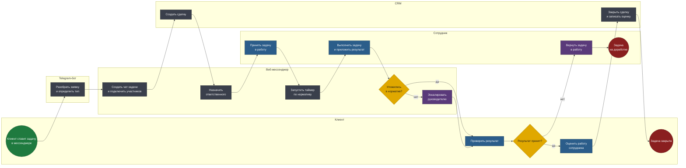
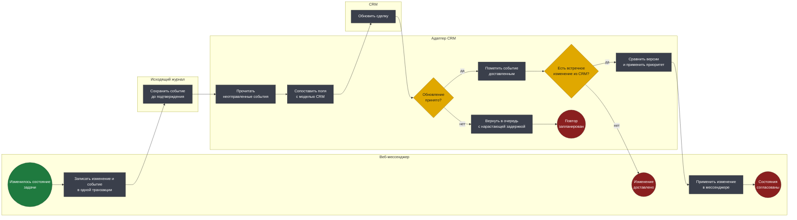

# BPMN 2.0 — B2B веб-мессенджер клиентских задач

Две модели: жизненный цикл задачи через два канала и синхронизация
состояния с CRM.

Исходники — в [diagrams/](diagrams/). Схемы генерируются из тех же моделей.

## Соглашения нотации

| Элемент | Как читать |
|---|---|
| Дорожка (lane) | Кто владеет шагом: клиент, бот, веб-мессенджер, сотрудник, CRM |
| Прямоугольник | Задача: синяя — ручная, серая — автоматическая, фиолетовая — отправка сообщения |
| Ромб | Исключающий шлюз |
| Зелёный / красный круг | Стартовое и конечное события |

---

## 1. Жизненный цикл клиентской задачи

Клиент ставит задачу в мессенджере, сотрудник работает в веб-интерфейсе,
состояние синхронизируется с CRM.

**Файл:** [`diagrams/01-task-lifecycle.bpmn`](diagrams/01-task-lifecycle.bpmn)

<!-- diagram:01-task-lifecycle -->

<!-- /diagram -->

### Решения, зашитые в модель

**Бот остаётся точкой входа для клиента.** Первая дорожка модели — не
веб-интерфейс, а мессенджер. Это главный вывод анализа: заказчик просил
«веб-версию бота», но клиенту удобно там, где он уже есть. Веб решает
задачу сотрудников, а не заменяет привычный клиенту канал. Попытка
переселить клиентов в новый интерфейс провалилась бы на первой неделе.

**Чат создаётся автоматически вместе с задачей.** Он не самостоятельная
сущность, которую кто-то заводит вручную, а часть жизненного цикла
задачи. Это убирает целый класс проблем: чаты без задач, задачи без
чатов, дубли переписки по одному вопросу.

**Сделка в CRM создаётся до назначения исполнителя.** Порядок важен:
идентификатор сделки нужен как общий ключ для двух систем с самого
начала. Создавать её после назначения — значит иметь окно, в котором
задача существует в мессенджере и не существует в CRM.

**Таймер запускается при взятии в работу, а не при создании задачи.**
Норматив измеряет работу сотрудника, а не скорость назначения. Считать
время с момента постановки — значит наказывать исполнителя за задержку
диспетчеризации, на которую он не влияет.

**Нарушение норматива эскалирует, но не блокирует.** Ветка «нет» ведёт к
уведомлению руководителя и вливается обратно в основной поток: задача
продолжает двигаться. Останавливать работу из-за просроченного таймера —
ухудшать ситуацию, которая и так плохая.

**Возврат на доработку завершает процесс явным событием, а не петлёй.**
Задача возвращается в работу как новый цикл со своим таймером. Так видно
реальное число итераций и не теряется история попыток.

---

## 2. Двусторонняя синхронизация с CRM

Модель отвечает на два вопроса: как гарантировать, что изменение дойдёт
до CRM, и что делать при встречном изменении.

**Файл:** [`diagrams/02-crm-sync.bpmn`](diagrams/02-crm-sync.bpmn)

<!-- diagram:02-crm-sync -->

<!-- /diagram -->

### Решения, зашитые в модель

**Изменение и событие пишутся в одной транзакции.** Это первый шаг
модели, и он решает классическую проблему двух записей: сохранить задачу
в своей базе и отправить обновление в CRM — две операции в разных
системах. Сбой между ними оставляет системы в расхождении. Событие
попадает в исходящий журнал вместе с изменением, публикуется отдельно.

**Недоставленное событие возвращается в очередь, а не теряется.** Ветка
отказа ведёт к повтору с нарастающей задержкой, а не к ошибке
пользователю. Сотрудник не должен видеть «не удалось обновить CRM» —
для него задача обновлена, а доставка это забота системы.

**Встречные изменения разрешаются явным правилом приоритета.** Двусторонняя
синхронизация неизбежно порождает конфликты: поле изменили с обеих
сторон почти одновременно. Модель не делает вид, что этого не бывает, —
в ней есть отдельный шаг сравнения версий. Правило приоритета
согласовывается с заказчиком, а не выбирается разработчиком по ходу дела.

**Разные исходы — разные конечные события.** «Изменение доставлено» и
«состояния согласованы после конфликта» — не одно и то же. Разделение
даёт видимость: если конфликтов становится много, это сигнал, что
процессы в двух системах расходятся организационно, а не технически.

---

## Что за границами моделей

- **Групповые чаты не по задачам** — общение сотрудников между собой
  ведётся в корпоративном мессенджере, дублировать его смысла нет.
- **Голосовые и видеозвонки** — не входили в скоуп.
- **Биллинг и выставление счетов** — остаются в CRM.
