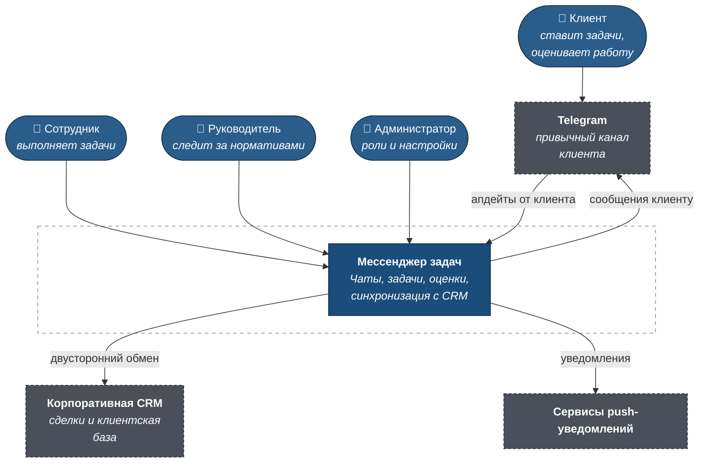
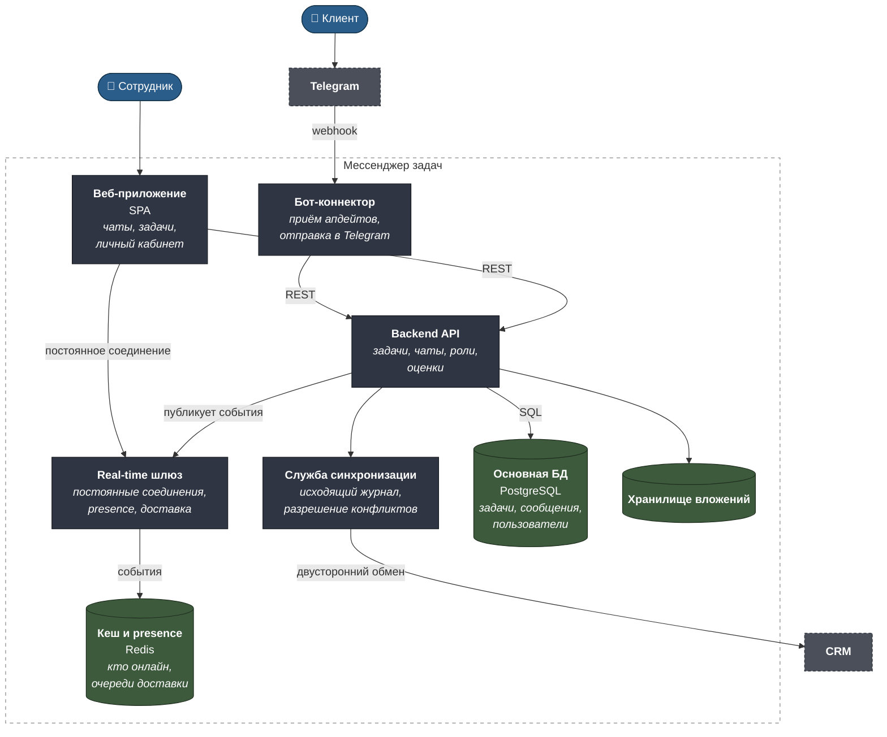
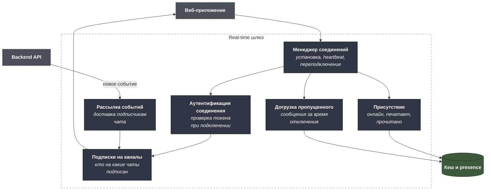
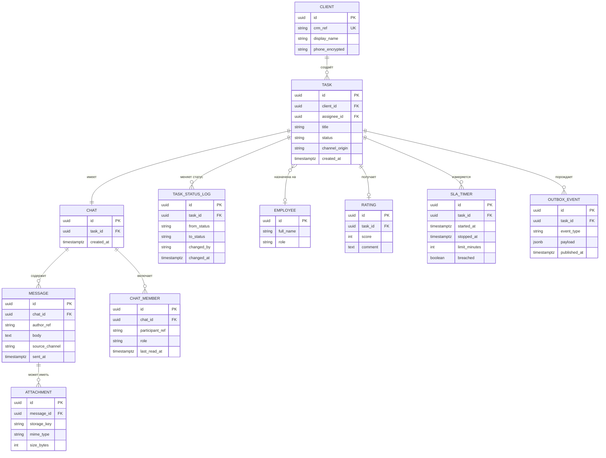

# C4 — B2B веб-мессенджер клиентских задач

Машиночитаемый исходник — [`c4/workspace.dsl`](c4/workspace.dsl).

---

## Уровень 1. Контекст



### Ключевая особенность контекста

**У клиента и сотрудника разные точки входа.** Клиент остаётся в
Telegram, сотрудник работает в веб-интерфейсе. Система — не «веб-версия
бота», а общий бэкенд для двух каналов над одной сущностью задачи.

Из этого следует главное архитектурное требование: **сообщение,
отправленное в любом канале, должно появиться в обоих**. Не как
пересылка, а как одна лента с двумя представлениями.

---

## Уровень 2. Контейнеры



### Почему так

**Real-time шлюз отделён от API.** Три тысячи параллельных соединений —
это профиль нагрузки, несовместимый с обычным запрос-ответным сервисом:
соединения долгоживущие, памяти на каждое немного, но их много, а
процессорной работы почти нет. Смешивать это с API, который обрабатывает
короткие тяжёлые запросы, — значит масштабировать оба по худшему из
профилей. Разделение позволяет добавлять узлы шлюза, не трогая API.

**Бот-коннектор — тонкий слой, а не вторая реализация логики.** Он
переводит апдейты Telegram во внутренние вызовы API и обратно. Вся логика
задач живёт в одном месте: иначе поведение двух каналов начнёт
расходиться, и это обнаружится не сразу.

**Presence и очереди доставки — в отдельном хранилище.** Статус «онлайн»
меняется постоянно и не переживает перезапуск; писать это в основную базу
бессмысленно. Там же — очереди недоставленных сообщений для пользователей,
которые сейчас офлайн.

**Служба синхронизации отделена от API.** У неё свой темп: повторы с
задержками, разрешение конфликтов, работа с недоступной CRM. Она не должна
влиять на отзывчивость интерфейса — сотрудник видит задачу обновлённой
сразу, доставка в CRM происходит следом.

---

## Уровень 3. Компоненты real-time шлюза



**Догрузка пропущенного — обязательный компонент, а не улучшение.**
Мобильная сеть рвётся постоянно: метро, лифт, переключение с Wi-Fi.
Пользователь, вернувшийся онлайн, должен увидеть всё, что пришло за время
отключения, — иначе сообщения будут теряться, и доверие к продукту
закончится за неделю. Клиент присылает метку последнего полученного
сообщения, шлюз догружает разницу.

**Аутентификация выполняется при установке соединения, а не на каждое
сообщение.** Проверять токен на каждом сообщении в постоянном соединении
дорого и бессмысленно. При этом соединение принудительно разрывается при
отзыве доступа — иначе уволенный сотрудник продолжит получать сообщения,
пока не закроет вкладку.

---

## Модель данных



**`MESSAGE.source_channel` — след канала происхождения.** Сообщение,
отправленное из Telegram, и сообщение из веб-интерфейса попадают в одну
ленту, но при разборе инцидентов важно знать, откуда оно пришло. То же
для `TASK.channel_origin`: статистика по каналам показывает, пользуются
ли сотрудники веб-интерфейсом или продолжают писать в бот.

**`CHAT_MEMBER.last_read_at` вместо флага «прочитано» на сообщении.**
При трёх тысячах активных сессий отметка на каждом сообщении для каждого
участника — это лишние записи в объёме, кратном числу сообщений.
Указатель на участнике даёт то же самое одной строкой.

**`SLA_TIMER` отдельной сущностью, а не полями в задаче.** У задачи,
вернувшейся на доработку, второй цикл со своим таймером. Хранить время в
полях задачи — значит потерять историю итераций и не суметь ответить,
сколько раз норматив нарушался.

**`CLIENT.phone_encrypted`.** Персональные данные шифруются на уровне
поля; доступ к расшифровке — по роли, с записью в журнал. Требование
152-ФЗ, а не перестраховка.

---

## Расчёт ёмкости: 3 000 параллельных сессий

| Что считаем | Логика | Вывод |
|---|---|---|
| Профиль соединений | Долгоживущие, малоактивные: сообщение раз в несколько минут | Ограничение по памяти на соединение, не по процессору |
| Пик активности | Рабочие часы, всплеск в начале дня | Масштабирование по расписанию, а не постоянный резерв |
| Объём сообщений | Умеренный: это рабочие задачи, а не общение | Основная нагрузка — удержание соединений, не обработка |
| Отключения | Мобильная сеть рвётся часто | Догрузка пропущенного — постоянная нагрузка, не редкая |
| Вложения | Фото и документы по задачам | Отдельное хранилище, отдача мимо API |

**Практический вывод.** Три тысячи соединений — не экстремальная нагрузка,
но она требует именно того разделения, которое заложено в архитектуру:
шлюз масштабируется горизонтально по числу соединений, API — по числу
запросов. Один сервис на обе задачи пришлось бы масштабировать по
худшему профилю, и это стоило бы кратно дороже.

---

## Как открыть DSL

```bash
docker run -it --rm -p 8080:8080 \
  -v "$PWD/projects/09-b2b-task-messenger/c4:/usr/local/structurizr" \
  structurizr/lite
```
