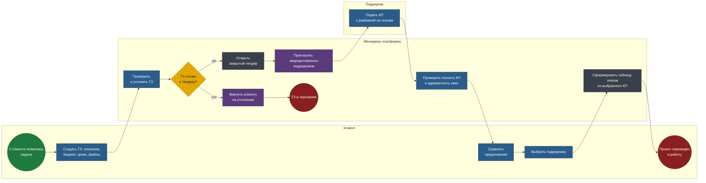
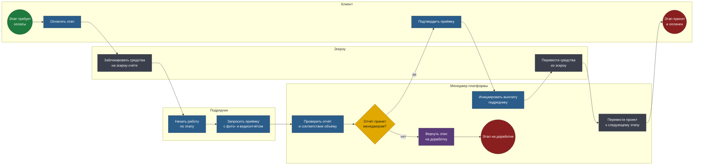

# BPMN 2.0 — B2B-платформа управления строительными проектами

Две модели покрывают сквозной сценарий: заключение сделки и цикл одного
этапа работ. Разделение не случайно — первый процесс проходит один раз на
проект, второй повторяется столько раз, сколько в проекте этапов.

Исходники — в [diagrams/](diagrams/). Схемы генерируются из тех же моделей.

## Соглашения нотации

| Элемент | Как читать |
|---|---|
| Дорожка (lane) | Кто владеет шагом: клиент, менеджер платформы, подрядчик, эскроу |
| Прямоугольник | Задача: синяя — ручная, серая — автоматическая, фиолетовая — отправка сообщения |
| Ромб | Исключающий шлюз |
| Зелёный / красный круг | Стартовое и конечное события |

---

## 1. От технического задания до старта работ

Закрытый тендер: подрядчиков приглашает менеджер из аккредитованного
пула, публичного доступа нет.

**Файл:** [`diagrams/01-project-lifecycle.bpmn`](diagrams/01-project-lifecycle.bpmn)

<!-- diagram:01-project-lifecycle -->

<!-- /diagram -->

### Решения, зашитые в модель

**Менеджер валидирует ТЗ до открытия тендера.** Клиент — не специалист по
строительству; его «нужен ремонт офиса под ключ» не годится для расчёта
сметы. Без этого шага подрядчики получат несопоставимые предложения по
разным объёмам работ, и клиент не сможет их сравнить. Шаг добавлен
намеренно: в исходных требованиях экрана валидации не было
([решение 8](requirements-log.md#решение-8-валидация-тз-менеджером)).

**Возврат на уточнение — явная ветка, а не устная договорённость.** Шлюз
«ТЗ готово к тендеру?» имеет второй выход в конечное событие «ТЗ в
черновике». Проект в этом состоянии виден клиенту с понятной причиной, а
не висит без движения.

**Тендер формируется из ТЗ, а не создаётся с нуля.** Прямое следствие
модели: всё начинается с потребности клиента. Возможность завести тендер
без ТЗ породила бы объекты без заказчика, не встраивающиеся в остальной
процесс
([решение 11](requirements-log.md#решение-11-источник-тендера)).

**Менеджер проверяет предложения до передачи клиенту.** Он фильтрует
неполные сметы и явно нереалистичные сроки. Это отличает платформу от
маркетплейса: клиент получает проверенный короткий список, а не всё, что
прислали.

**Этапы выбранного предложения сразу становятся рабочей таблицей.**
Подрядчик уже разбил работу на этапы, клиент это разбиение выбрал.
Дополнительное согласование того же разбиения — лишний шаг
([решение 9](requirements-log.md#решение-9-переход-от-выбора-подрядчика-к-этапам)).

---

## 2. Эскроу-цикл одного этапа

Повторяется для каждого этапа проекта. Здесь работает главный механизм
продукта: деньги как гарантия исполнения.

**Файл:** [`diagrams/02-stage-acceptance.bpmn`](diagrams/02-stage-acceptance.bpmn)

<!-- diagram:02-stage-acceptance -->

<!-- /diagram -->

### Решения, зашитые в модель

**Средства блокируются до начала работ, а не после приёмки.** Это ядро
модели доверия. Подрядчик начинает работу, зная, что деньги за этап уже
зарезервированы; клиент знает, что они не уйдут до подтверждения приёмки.
Оплата после выполнения оставила бы подрядчика без гарантии, предоплата —
клиента.

**Приёмка проходит два контура: менеджер и клиент.** Менеджер проверяет
отчёт профессионально — соответствие объёму, полноту фотофиксации. Клиент
подтверждает по факту. Убрать менеджера — превратить платформу в
маркетплейс, где стороны разбираются сами; убрать клиента — лишить его
контроля над своими деньгами
([решение 10](requirements-log.md#решение-10-порядок-приёмки-этапа)).

**Возврат на доработку завершается явным событием, а не петлёй.** Этап
уходит в состояние «на доработке», из которого начинается новый цикл. Так
видно реальное число итераций по этапу — показатель, который теряется при
моделировании возврата циклом.

**Выплату инициирует менеджер, а не автоматика.** Даже после подтверждения
клиентом деньги уходят по действию человека. Автоматический перевод по
событию означал бы, что ошибка в статусе превращается в необратимую
финансовую операцию.

**Переход к следующему этапу — отдельный шаг.** Проект не переключается на
следующий этап автоматически: между этапами возможна пауза, изменение
объёма или расторжение. Явный шаг оставляет для этого место.

---

## Что за границами моделей

- **Реальная банковская интеграция** — в прототипе финансовый контур
  показан кликабельными макетами
  ([решение 1](requirements-log.md#решение-1-эскроу-реальный-или-макет)).
- **Юридический документооборот и подписание** — договор отображается как
  файл, экраны подписания не проектируются
  ([решение 15](requirements-log.md#решение-15-подписание-договора-вне-прототипа)).
- **Аккредитация подрядчиков** — процесс попадания в пул платформы
  выходит за границы прототипа: он проверяет работу с уже
  аккредитованными.
- **Претензионная работа и расторжение** — сценарии, которых в исходных
  требованиях не было; проектировать их наугад означало бы угадывать.
