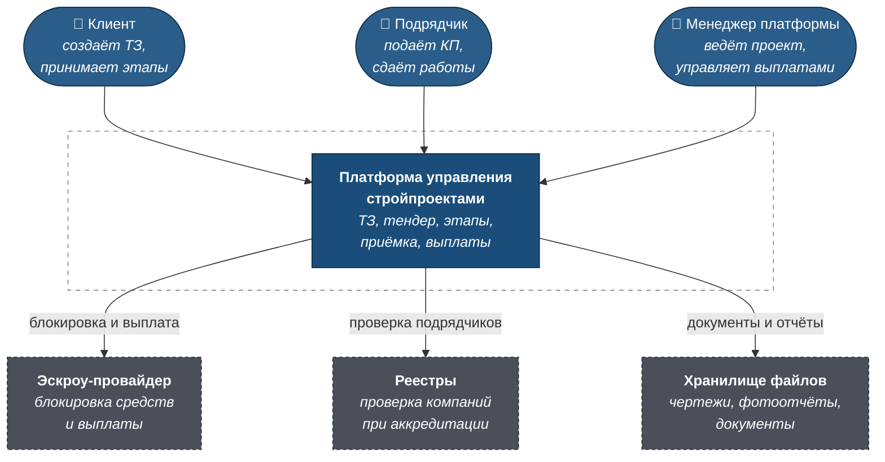
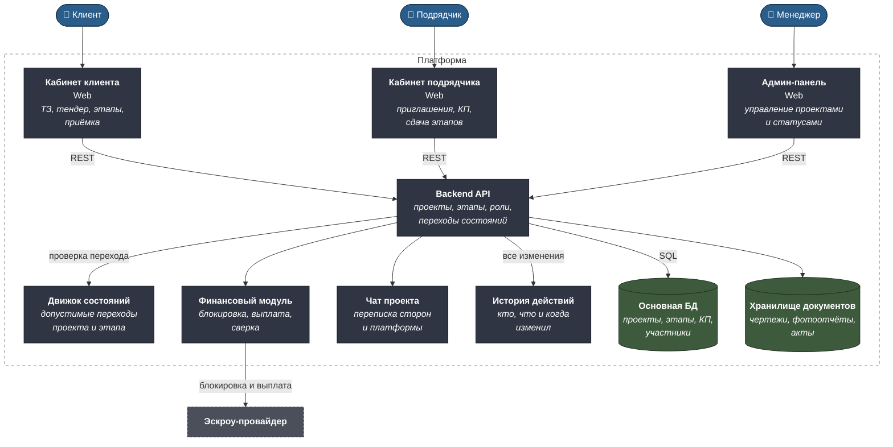
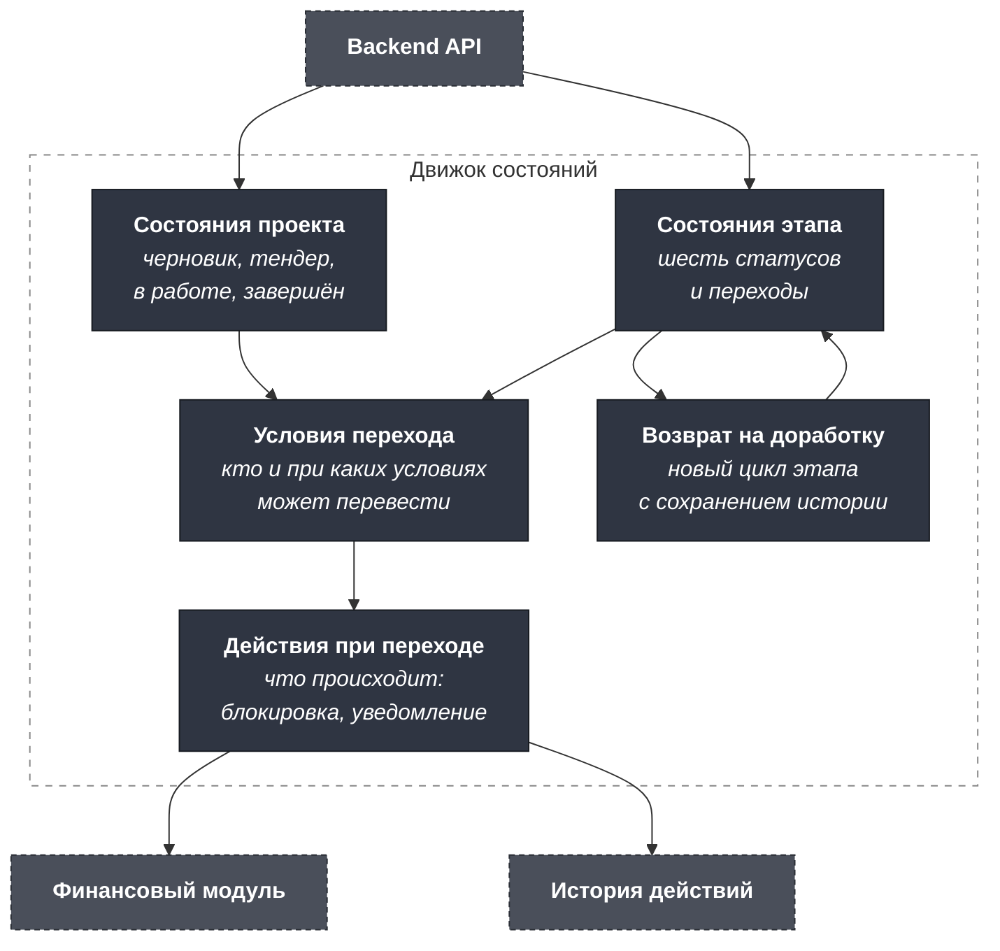
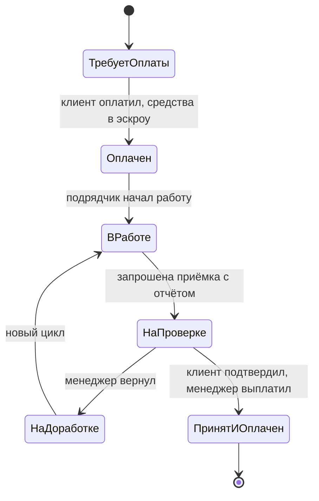
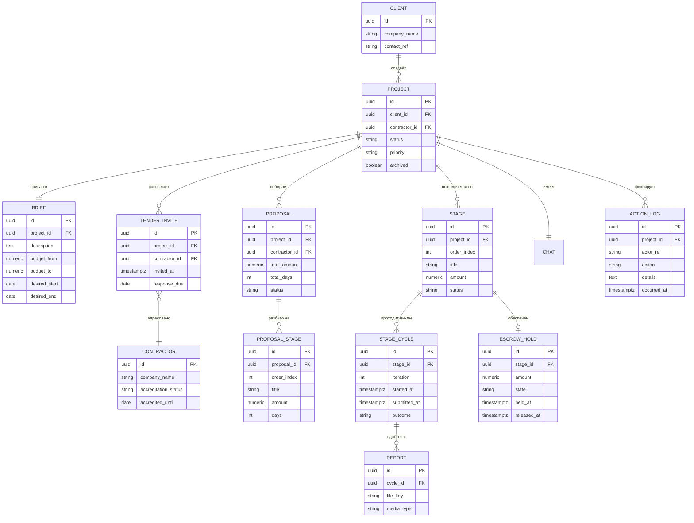

# C4 — B2B-платформа управления строительными проектами

Машиночитаемый исходник — [`c4/workspace.dsl`](c4/workspace.dsl).

Архитектура описана для целевого продукта. Прототип, на который были
исходные требования, реализует интерфейсный слой на статичных данных —
см. [requirements-log.md](requirements-log.md).

---

## Уровень 1. Контекст



### Границы

**В скоупе:** создание и валидация ТЗ, закрытый тендер, сравнение
предложений, таблица этапов, эскроу-цикл этапа, приёмка, чат проекта,
документы, история действий.

**Вне скоупа прототипа:** реальная банковская интеграция, аккредитация
подрядчиков, юридическое подписание договоров, публичный каталог,
рейтинги и отзывы, мобильная версия под телефон.

**Ключевая особенность контекста:** менеджер платформы — не наблюдатель, а
участник каждой сделки. Он валидирует ТЗ, приглашает подрядчиков,
проверяет приёмку и инициирует выплату. Это отличает продукт от
маркетплейса и определяет, что админ-панель — самый насыщенный из трёх
интерфейсов, а не служебный экран.

---

## Уровень 2. Контейнеры



### Почему так

**Три отдельных приложения, а не одно с переключением ролей.** У клиента,
подрядчика и менеджера принципиально разная функциональность: клиент
создаёт ТЗ и принимает работы, подрядчик подаёт предложения и сдаёт
этапы, менеджер управляет всем. Общий интерфейс с условным отображением
превратился бы в набор скрытых блоков, где половина кода отвечает на
вопрос «а можно ли это показать».

В прототипе для демонстрации добавлен переключатель ролей — это
осознанное отступление от продуктовой логики ради показа
([решение 6](requirements-log.md#решение-6-вход-и-переключение-ролей-сосуществуют)).

**Движок состояний вынесен отдельно.** Проект и этап имеют строго
определённые статусы и переходы между ними. Если проверять допустимость
перехода в коде каждого обработчика, правила разъедутся: где-то забудут
запретить оплату уже оплаченного этапа. Единый движок отвечает на вопрос
«можно ли перейти из А в Б» в одном месте.

**Финансовый модуль изолирован от остальной логики.** Через него проходят
операции с деньгами: блокировка, выплата, сверка. Изоляция даёт
возможность отдельно логировать, отдельно тестировать и отдельно
проверять эти операции. В прототипе модуль подменяется макетами, но
граница проведена сразу
([решение 1](requirements-log.md#решение-1-эскроу-реальный-или-макет)).

**История действий пишется на уровне API, а не в каждом модуле.** Любое
изменение статуса, суммы или срока попадает в журнал автоматически. При
споре о том, кто изменил сумму этапа, ответ должен существовать.

---

## Уровень 3. Компоненты движка состояний



**Условия перехода отделены от действий при переходе.** «Кто имеет право
перевести этап в этот статус» и «что произойдёт при переводе» — разные
вопросы. Клиент может подтвердить приёмку, но выплату инициирует
менеджер: право на переход и следствие перехода принадлежат разным ролям.

**Возврат на доработку моделируется как новый цикл, а не откат.** Этап
получает новую итерацию, предыдущая сохраняется. Иначе теряется главный
показатель качества работы подрядчика — сколько раз этап возвращали.

---

## Модель состояний

### Статусы проекта

| Статус | Когда наступает |
|---|---|
| Черновик | ТЗ создано, ожидает валидации менеджером |
| Тендер | Тендер открыт, идёт сбор и выбор предложений |
| В работе | Подрядчик выбран, идёт выполнение этапов |
| На приёмке | Этап сдан и проходит проверку |
| Завершён | Все этапы приняты и оплачены |

Архив — не статус, а признак завершённого проекта
([решение 4](requirements-log.md#решение-4-архивирование--признак-а-не-статус)).

### Статусы этапа



Единый перечень из шести статусов заменил два конфликтующих набора из
исходных требований
([решение 2](requirements-log.md#решение-2-единый-перечень-статусов-этапа)).

---

## Модель данных



**`PROPOSAL_STAGE` и `STAGE` — разные сущности.** Первое — этапы в
предложении подрядчика, которые могут не выиграть. Второе — рабочие этапы
проекта, сформированные из выбранного предложения. Хранить их одной
таблицей означало бы, что этапы проигравших предложений живут в проекте.

**`STAGE_CYCLE` отделён от `STAGE`.** Этап, вернувшийся на доработку, —
это новая итерация с новым отчётом. Хранить даты и отчёт полями этапа —
значит затирать историю при каждом возврате и потерять показатель, сколько
раз работу переделывали.

**`ESCROW_HOLD.state` фиксирует состояние денег отдельно от статуса
этапа.** Статус этапа — про работу, состояние блокировки — про деньги. Их
рассинхронизация возможна при сбое внешнего провайдера, и система должна
уметь это увидеть, а не считать, что раз этап оплачен, то средства
заблокированы.

**`CONTRACTOR.accredited_until`.** Аккредитация имеет срок; подрядчик с
истёкшей не должен получать приглашения в новые тендеры, даже если ранее
работал успешно.

---

## Как открыть DSL

```bash
docker run -it --rm -p 8080:8080 \
  -v "$PWD/projects/10-construction-platform/c4:/usr/local/structurizr" \
  structurizr/lite
```
